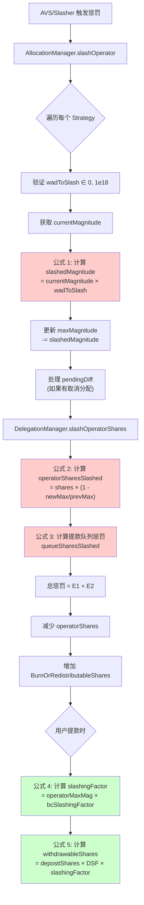

# EigenLayer 惩罚(Slashing)计算公式详解

> 本文档按照惩罚逻辑执行顺序，详细整理 EigenLayer 协议中的所有惩罚相关计算公式，并配有实际计算示例。

---

## 📋 目录

1. [惩罚流程概述](#惩罚流程概述)
2. [核心数据结构](#核心数据结构)
3. [计算公式（按执行顺序）](#计算公式按执行顺序)
   - [阶段 1: Magnitude 惩罚计算](#阶段-1-magnitude-惩罚计算)
   - [阶段 2: Operator Shares 惩罚计算](#阶段-2-operator-shares-惩罚计算)
   - [阶段 3: 提款队列惩罚计算](#阶段-3-提款队列惩罚计算)
   - [阶段 4: 综合惩罚因子计算](#阶段-4-综合惩罚因子计算)
   - [阶段 5: 可提取份额计算](#阶段-5-可提取份额计算)
4. [完整计算示例](#完整计算示例)
5. [特殊场景处理](#特殊场景处理)
6. [关键常量和限制](#关键常量和限制)

---

## 一. 惩罚流程概述



**关键执行路径：**

1. **触发阶段**: AVS 的 Slasher 调用 `AllocationManager.slashOperator()`
2. **Magnitude 惩罚**: 减少 Operator 在 OperatorSet 中的 `maxMagnitude`
3. **Shares 惩罚**: 计算并减少 Operator 的实际份额（包括活跃份额和提款队列中的份额）
4. **影响传播**: 通过 `slashingFactor` 影响所有委托者的可提取金额

---

## 二. 核心数据结构

### 1. SlashingParams (惩罚参数)

```solidity
struct SlashingParams {
    address operator;              // 被惩罚的操作员
    uint32 operatorSetId;         // 操作员集 ID
    IStrategy[] strategies;       // 被惩罚的策略列表
    uint256[] wadsToSlash;        // 每个策略的惩罚比例 [0 < x ≤ 1e18]
    string description;           // 惩罚原因描述
}
```

**代码位置**: `src/contracts/interfaces/IAllocationManager.sol:132-138`

### 2. Allocation (分配信息)

```solidity
struct Allocation {
    uint64 currentMagnitude;   // 当前已分配的幅度
    int128 pendingDiff;        // 待生效的幅度变化 (可正可负)
    uint32 effectBlock;        // pendingDiff 生效的区块号
}
```

**代码位置**: `src/contracts/interfaces/IAllocationManager.sol:78-82`

**说明**:

- `currentMagnitude`: 操作员在特定 OperatorSet 和 Strategy 下的当前分配量
- `pendingDiff < 0`: 表示有待取消的分配（在 `DEALLOCATION_DELAY` 期间内仍可被惩罚）

### 3. DepositScalingFactor (存款缩放因子)

```solidity
struct DepositScalingFactor {
    uint256 _scalingFactor;  // 内部值，初始为 0（等同于 WAD = 1e18）
}

// 公开接口
function scalingFactor() internal pure returns (uint256) {
    return _scalingFactor == 0 ? WAD : _scalingFactor;
}
```

**代码位置**: `src/contracts/libraries/SlashingLib.sol:28-37`

**作用**:

- **不是惩罚记录器**，而是在不同惩罚状态下保持份额"公平性"的缩放因子
- **只在增加委托时更新**（存款、重新委托），**不在惩罚时更新**
- 用于处理不同时期存款的"公平性"问题

---

## 三. 计算公式（按执行顺序）

### 阶段 1: Magnitude 惩罚计算

#### 公式 1.1: 计算被惩罚的 Magnitude

```solidity
slashedMagnitude = ⌈currentMagnitude × wadToSlash / WAD⌉  // 向上取整
```

**参数说明**:

- `currentMagnitude` (uint64): 操作员当前在该 OperatorSet 和 Strategy 下的分配幅度
- `wadToSlash` (uint256): 惩罚比例，范围 (0, 1e18]，其中 1e18 = 100%
- `WAD` = 1e18 (精度基准)

**代码位置**: `src/contracts/core/AllocationManager.sol:455`

```solidity
uint64 slashedMagnitude = uint64(
    uint256(allocation.currentMagnitude).mulWadRoundUp(params.wadsToSlash[i])
);
```

**向上取整原因**: 防止多次小额惩罚被舍入为 0，确保惩罚有效

---

#### 公式 1.2: 更新 maxMagnitude

```solidity
newMaxMagnitude = prevMaxMagnitude - slashedMagnitude
```

**代码位置**: `src/contracts/core/AllocationManager.sol:459-460`

```solidity
uint64 prevMaxMagnitude = info.maxMagnitude;
info.maxMagnitude -= slashedMagnitude;
```

**同时更新**:

```solidity
allocation.currentMagnitude -= slashedMagnitude;
info.encumberedMagnitude -= slashedMagnitude;
```

---

#### 公式 1.3: 计算实际惩罚比例 (wadSlashed)

```solidity
wadSlashed = slashedMagnitude / prevMaxMagnitude  // 向下取整
```

**代码位置**: `src/contracts/core/AllocationManager.sol:461`

```solidity
wadSlashed[i] = uint256(slashedMagnitude).divWad(info.maxMagnitude);
```

**注意**:

- 此值用于后续计算，表示相对于历史最大值的惩罚比例
- 可能与输入的 `wadToSlash` 略有不同（因 maxMagnitude 可能已被之前的惩罚减少）

---

#### 示例 1.1: 基础 Magnitude 惩罚

**场景**: Operator 首次被惩罚 10%

**初始状态**:

```
currentMagnitude = 1,000,000,000,000,000,000 (1e18, 即 100%)
prevMaxMagnitude = 1,000,000,000,000,000,000
wadToSlash       = 100,000,000,000,000,000  (0.1e18, 即 10%)
```

**计算过程**:

```
步骤 1: 计算 slashedMagnitude
  = ⌈1e18 × 0.1e18 / 1e18⌉
  = ⌈0.1e18⌉
  = 100,000,000,000,000,000

步骤 2: 更新 maxMagnitude
  newMaxMagnitude = 1e18 - 0.1e18
                  = 900,000,000,000,000,000 (0.9e18)

步骤 3: 计算 wadSlashed
  wadSlashed = 0.1e18 / 1e18
             = 0.1e18 (即 10%)
```

**结果**:

- slashedMagnitude = 0.1e18
- newMaxMagnitude = 0.9e18 (剩余 90%)
- wadSlashed = 0.1e18

---

#### 示例 1.2: 连续两次惩罚

**场景**: Operator 先被惩罚 10%，再被惩罚 20%

**第一次惩罚**:

```
currentMagnitude = 1e18
wadToSlash       = 0.1e18 (10%)

计算:
  slashedMagnitude = 0.1e18
  newMaxMagnitude  = 0.9e18
```

**第二次惩罚**:

```
currentMagnitude = 900,000,000,000,000,000 (0.9e18)
prevMaxMagnitude = 0.9e18
wadToSlash       = 0.2e18 (20%)

计算:
  slashedMagnitude = ⌈0.9e18 × 0.2e18 / 1e18⌉
                   = ⌈0.18e18⌉
                   = 180,000,000,000,000,000

  newMaxMagnitude = 0.9e18 - 0.18e18
                  = 0.72e18 (剩余 72%)
```

**累计效果**:

- 初始: 100%
- 第一次后: 90%
- 第二次后: 72% (不是 70%，因为第二次是对剩余 90% 的 20%)

---

#### 公式 1.4: 处理 pending 取消分配 (pendingDiff < 0)

如果操作员正在取消分配（处于 `DEALLOCATION_DELAY` 期间），pending 的取消量也会被惩罚：

```solidity
if (pendingDiff < 0) {
    slashedPending = ⌈|pendingDiff| × wadToSlash / WAD⌉
    pendingDiff += slashedPending  // 减少取消量（因为 pendingDiff 是负数）
}
```

**代码位置**: `src/contracts/core/AllocationManager.sol:465-477`

**示例**:

```
假设:
  pendingDiff = -0.3e18 (计划取消 30%)
  wadToSlash = 0.1e18 (惩罚 10%)

计算:
  slashedPending = ⌈0.3e18 × 0.1e18 / 1e18⌉
                 = 0.03e18

  新 pendingDiff = -0.3e18 + 0.03e18
                 = -0.27e18 (只能取消 27% 了)
```

---

### 阶段 2: Operator Shares 惩罚计算

#### 公式 2.1: 计算操作员份额被惩罚量 (核心公式)

```solidity
operatorSharesSlashed = operatorShares - ⌈operatorShares × newMaxMagnitude / prevMaxMagnitude⌉
```

**代码位置**: `src/contracts/libraries/SlashingLib.sol:182-189`

```solidity
function calcSlashedAmount(
    uint256 operatorShares,
    uint256 prevMaxMagnitude,
    uint256 newMaxMagnitude
) internal pure returns (uint256) {
    return operatorShares - operatorShares.mulDiv(
        newMaxMagnitude,
        prevMaxMagnitude,
        Math.Rounding.Up  // 向上取整，防止过度惩罚
    );
}
```

**参数说明**:

- `operatorShares`: Operator 当前持有的该策略份额总量
- `prevMaxMagnitude`: 惩罚前的最大幅度
- `newMaxMagnitude`: 惩罚后的最大幅度

**调用位置**: `src/contracts/core/DelegationManager.sol:287-291`

---

#### 示例 2.1: 基础份额惩罚

**场景**: Operator 持有 10,000 份额，被惩罚 10%

**初始状态**:

```
operatorShares   = 10,000
prevMaxMagnitude = 1e18
newMaxMagnitude  = 0.9e18 (惩罚 10% 后)
```

**计算过程**:

```
 (使用代码逻辑):
  保留份额 = ⌈10,000 × 0.9e18 / 1e18⌉
           = ⌈9,000⌉
           = 9,000

  operatorSharesSlashed = 10,000 - 9,000
                        = 1,000
```

**结果**:

- 惩罚份额: 1,000
- 剩余份额: 9,000 (90%)

---

#### 示例 2.2: 连续惩罚对份额的影响

**场景**: 先惩罚 10%，再惩罚 20%

**第一次惩罚**:

```
operatorShares   = 10,000
prevMaxMagnitude = 1e18
newMaxMagnitude  = 0.9e18

计算:
  operatorSharesSlashed = 10,000 × (1 - 0.9e18/1e18)
                        = 1,000
  新 operatorShares = 9,000
```

**第二次惩罚**:

```
operatorShares   = 9,000 (第一次惩罚后)
prevMaxMagnitude = 0.9e18
newMaxMagnitude  = 0.72e18 (0.9e18 - 0.18e18)

计算:
  operatorSharesSlashed = 9,000 × (1 - 0.72/0.9)
                        = 9,000 × 0.2
                        = 1,800
  新 operatorShares = 7,200
```

**累计效果**:

- 初始: 10,000 份额 (100%)
- 第一次后: 9,000 份额 (90%)
- 第二次后: 7,200 份额 (72%)

**验证**: 7,200 / 10,000 = 0.72 = newMaxMagnitude / 初始 MaxMagnitude

---

### 阶段 3: 提款队列惩罚计算

当 Staker 发起提款请求后，在提款完成前，如果 Operator 被惩罚，提款队列中的份额也会受到影响。

#### 公式 3.1: 获取提款队列中的可惩罚份额

```solidity
queueSharesSlashed = Σ (每个提款请求的可惩罚份额)
```

**对于每个提款请求**:

```solidity
//计算提款队列在窗口期内[block.number - MIN_WITHDRAWAL_DELAY_BLOCKS, block.number]的shares
curQueuedScaledShares = operatorScaledSharesAtCurrentBlock(operator, strategy)
prevQueuedScaledShares = operatorScaledSharesAtWithdrawalBlock(operator, strategy)

//这些shares可以被slash
scaledSharesAdded = curQueuedScaledShares - prevQueuedScaledShares

slashableScaledShares = ⌊scaledSharesAdded × (1 - newMaxMagnitude / prevMaxMagnitude)⌋

queueSharesSlashed += ⌊slashableScaledShares / curDSF⌋  // 转换回普通份额
```

**代码位置**: `src/contracts/core/DelegationManager.sol:759-794`

**关键概念**:

- **ScaledShares (缩放份额)**: 用于追踪历史累计，考虑了惩罚因子
- **提款窗口**: `[withdrawalBlock, currentBlock]`，只有在此期间发生的惩罚才影响该提款

---

#### 示例 3.1: 提款队列惩罚

**场景**: Staker 在区块 100 发起提款，在区块 200 发生惩罚

**初始状态**:

```
withdrawalBlock = 100
currentBlock    = 200
withdrawalShares = 5,000

区块 100 时的累计 scaledShares = 50,000
区块 200 时的累计 scaledShares = 60,000
```

**计算过程**:

```
步骤 1: 计算提款期间增加的 scaledShares
  scaledSharesAdded = 60,000 - 50,000
                    = 10,000

步骤 2: 假设惩罚 10% (prevMax=1e18, newMax=0.9e18)
  slashableScaledShares = 10,000 × (1 - 0.9/1)
                        = 1,000

步骤 3: 转换回普通份额 (假设 curDSF = 1e18)
  queueSharesSlashed = 1,000 / 1e18 × 1e18
                     = 1,000

步骤 4: 总惩罚
  totalSlashed = operatorSharesSlashed + queueSharesSlashed
```

---

### 阶段 4: 综合惩罚因子计算

当 Staker 提款时，需要计算综合惩罚因子来确定实际可提取金额。

#### 公式 4.1: 非 ETH 策略的惩罚因子

```solidity
slashingFactor = operatorMaxMagnitude
```

**代码位置**: `src/contracts/core/DelegationManager.sol:715`

**说明**:

- 对于 ERC20 token 策略，惩罚因子就是 Operator 当前的 maxMagnitude
- 初始值为 1e18 (100%)，每次惩罚后减少

---

#### 公式 4.2: ETH 策略的双重惩罚因子

```solidity
slashingFactor = operatorMaxMagnitude × beaconChainSlashingFactor / WAD
```

**代码位置**: `src/contracts/core/DelegationManager.sol:709-712`

```solidity
if (strategy == beaconChainETHStrategy) {
    uint64 beaconChainSlashingFactor = eigenPodManager.beaconChainSlashingFactor(staker);
    return operatorMaxMagnitude.mulWad(beaconChainSlashingFactor);
}
```

**参数说明**:

- `operatorMaxMagnitude`: AVS 层面的惩罚（由 AllocationManager 管理）
- `beaconChainSlashingFactor`: Beacon Chain 层面的惩罚（由 EigenPodManager 管理）

**特性**:

- 支持双重惩罚：同时惩罚 Beacon Chain 违规和 AVS 违规
- 两个惩罚因子相乘，惩罚是复合的（不是相加）

---

#### 示例 4.1: 非 ETH 策略惩罚因子

**场景**: USDC 策略，Operator 被惩罚两次

```
初始: operatorMaxMagnitude = 1e18

第一次惩罚 10%:
  newMaxMagnitude = 0.9e18
  slashingFactor = 0.9e18 (90%)

第二次惩罚 20%:
  newMaxMagnitude = 0.72e18
  slashingFactor = 0.72e18 (72%)
```

---

#### 示例 4.2: ETH 策略双重惩罚

**场景**: Native ETH 质押，同时发生 AVS 和 Beacon Chain 惩罚

```
初始状态:
  operatorMaxMagnitude = 1e18
  beaconChainSlashingFactor = 1e18

AVS 惩罚 10%:
  operatorMaxMagnitude = 0.9e18

Beacon Chain 惩罚 5%:
  beaconChainSlashingFactor = 0.95e18

计算综合惩罚因子:
  slashingFactor = 0.9e18 × 0.95e18 / 1e18
                 = 0.855e18 (85.5%)

解释:
  - 不是 0.9 × 0.95 = 0.855 吗？为什么要除以 1e18？
  - 因为两个因子都是以 WAD (1e18) 为单位的
  - 0.9e18 × 0.95e18 = 0.855e36
  - 需要除以 1e18 还原为正确的单位
```

**结果**: Staker 最终只能提取 85.5% 的资产

---

### 阶段 5: 可提取份额计算

> DSF 不是在惩罚时更新，而是在增加委托时更新！

#### 核心理解

**常见误解**:

- DSF 在惩罚时被更新
- DSF 记录"累计惩罚"

**正确理解**:

- **DSF 只在增加委托时更新**（存款、重新委托）
- **DSF 不记录惩罚**，而是在**不同惩罚状态下保持份额公平性的缩放因子**
- **惩罚通过 `operatorShares` 的减少直接体现**

---

#### 公式 5.1: 增加委托时更新 DSF

**触发时机**: 用户存款或增加委托时（`DelegationManager.increaseDelegatedShares`）

**代码位置**: `src/contracts/libraries/SlashingLib.sol:90-138`

##### 情况 A: 首次存款 (prevDepositShares == 0)

```solidity
公式：
newDSF = oldDSF / slashingFactor
```

**代码**:

```solidity
if (prevDepositShares == 0) {
    dsf._scalingFactor = dsf.scalingFactor().divWad(slashingFactor);
    return;
}
```

**含义**: "宽恕"之前的惩罚，让新存款在当前惩罚状态下"公平"开始

**示例**:

```
场景: Operator 已被惩罚 10%，Staker 首次存款 10,000 份额

初始:
  operatorMaxMagnitude = 0.9e18 (被惩罚 10%)
  slashingFactor = 0.9e18
  prevDepositShares = 0
  addedShares = 10,000

计算:
  oldDSF = 1e18 (默认)
  newDSF = 1e18 / (0.9e18 / 1e18) = 1.111e18

  operatorShares[operator][strategy] += 10,000

提款时:
  withdrawableShares = depositShares × DSF × slashingFactor
                     = 10,000 × 1.111e18 / 1e18 × 0.9e18 / 1e18
                     = 10,000 × 1.0
                     = 10,000

解释:
  DSF = 1.111 "抵消"了 slashingFactor = 0.9 的影响
  让新 Staker 在当前惩罚状态下"公平"开始
```

---

##### 情况 B: 增加存款 (prevDepositShares > 0)

```
公式：
newDSF = (currentShares + addedShares) / ((prevDepositShares + addedShares) × slashingFactor)
```

**数学推导**（SlashingLib.sol 代码注释 行 104-121）:

```
目标: 保持存款前后的"价值"一致

基础方程:
  withdrawableShares = depositShares × DSF × slashingFactor

存款前:
  currentShares = prevDepositShares × oldDSF × slashingFactor

存款后:
  newShares = currentShares + addedShares
  newDepositShares = prevDepositShares + addedShares
  newShares = newDepositShares × newDSF × slashingFactor

求解 newDSF:
  newDSF = (currentShares + addedShares) / ((prevDepositShares + addedShares) × slashingFactor)
```

**代码实现**:

```solidity
// 计算当前可提取份额
uint256 currentShares = dsf.calcWithdrawable(prevDepositShares, slashingFactor);

// 加上新增份额
uint256 newShares = currentShares + addedShares;

// 计算新的 DSF
uint256 newDepositScalingFactor = newShares
    .divWad(prevDepositShares + addedShares)
    .divWad(slashingFactor);

dsf._scalingFactor = newDepositScalingFactor;
```

---

#### 公式 5.2: 惩罚时的处理

**关键**: 惩罚时 **DSF 不变**，只有 `operatorShares` 减少！

**代码位置**: `DelegationManager.slashOperatorShares()` (行 279-319)

```solidity
function slashOperatorShares(
    address operator,
    OperatorSet calldata operatorSet,
    uint256 slashId,
    IStrategy strategy,
    uint64 prevMaxMagnitude,
    uint64 newMaxMagnitude
) external returns (uint256) {
    // 计算 operatorShares 被惩罚量
    uint256 operatorSharesSlashed = SlashingLib.calcSlashedAmount({
        operatorShares: operatorShares[operator][strategy],
        prevMaxMagnitude: prevMaxMagnitude,
        newMaxMagnitude: newMaxMagnitude
    });

    // 减少 operatorShares
    // _decreaseDelegation
    operatorShares[operator][strategy] -= operatorSharesSlashed;

    // 注意: Staker 的 DSF 没有被更新！
}
```

**惩罚影响传播**:

- `operatorShares` 被减少
- `slashingFactor` (operatorMaxMagnitude) 降低
- Staker 的 DSF 保持不变

---

#### 公式 5.3: 提款队列时

**代码位置**: `SlashingLib.sol:76-81`

```solidity
function scaleForQueueWithdrawal(
    DepositScalingFactor memory dsf,
    uint256 depositSharesToWithdraw
) internal pure returns (uint256) {
    return depositSharesToWithdraw.mulWad(dsf.scalingFactor());
}
```

**公式**:

```
scaledShares = depositShares × DSF / WAD
```

---

#### 公式 5.4: 完成提款时（最终公式）

**代码位置**: `DelegationManager._completeQueuedWithdrawal()` (行 535-617)

**关键代码** (行 554-559):

```solidity
// 获取提款队列时的 slashingFactors
uint256[] memory prevSlashingFactors = _getSlashingFactorsAtBlock({
    staker: withdrawal.staker,
    operator: withdrawal.delegatedTo,
    strategies: withdrawal.strategies,
    blockNumber: slashableUntil  // 提款队列的最后可惩罚区块
});
```

**行 578-581**:

```solidity
uint256 sharesToWithdraw = SlashingLib.scaleForCompleteWithdrawal({
    scaledShares: withdrawal.scaledShares[i],
    slashingFactor: prevSlashingFactors[i]  // 队列时的惩罚因子！
});
```

**`scaleForCompleteWithdrawal` 实现** (`SlashingLib.sol:83-88`):

```solidity
function scaleForCompleteWithdrawal(
    uint256 scaledShares,
    uint256 slashingFactor
) internal pure returns (uint256) {
    return scaledShares.mulWad(slashingFactor);
}
```

**最终公式**:

```
withdrawableShares = scaledShares × slashingFactor_atQueue / WAD
                   = (depositShares × DSF) × slashingFactor_atQueue / WAD²
```

**关键理解**:

- `scaledShares`: 在队列时计算并存储 = `depositShares × DSF / WAD`
- `slashingFactor_atQueue`: **提款队列时**记录的 Operator maxMagnitude（不是当前值！）
- 提款队列期间发生的惩罚通过 `_getSlashableSharesInQueue` 单独计算并销毁

---

## 四. 完整计算示例

### 示例 1: 首次存款（Operator 已被惩罚）

```
=== T0: Operator 被惩罚 10% ===
operatorMaxMagnitude = 1e18 → 0.9e18

=== T1: Staker 首次存入 10,000 份额 ===

存款时 (increaseDelegatedShares):
  prevDepositShares = 0
  addedShares = 10,000
  slashingFactor = 0.9e18

更新 DSF (情况 A - 首次存款):
  oldDSF = 1e18
  newDSF = 1e18 / (0.9e18 / 1e18)
         = 1.111...e18

增加 operatorShares:
  operatorShares[operator][strategy] += 10,000

状态:
  ✓ Staker depositShares (在 StrategyManager): 10,000
  ✓ Staker DSF: 1.111e18
  ✓ operatorShares: 10,000

=== T2: Staker 提款 (全部) ===

队列提款:
  depositShares = 10,000
  DSF = 1.111e18

  scaledShares = 10,000 × 1.111e18 / 1e18
               = 11,111

  记录:
    withdrawal.scaledShares = 11,111
    withdrawal.maxMagnitudeAtQueue = 0.9e18

完成提款 (假设无新惩罚):
  scaledShares = 11,111
  slashingFactor_atQueue = 0.9e18

  withdrawableShares = 11,111 × 0.9e18 / 1e18
                     = 10,000

结果: ✓ Staker 提取 10,000 份额 (全额)
```

**关键理解**:

- DSF = 1.111 "抵消"了 slashingFactor = 0.9 的影响
- `scaledShares × slashingFactor = (depositShares × DSF) × slashingFactor`
- `= depositShares × (DSF × slashingFactor)`
- `= 10,000 × (1.111 × 0.9) = 10,000 × 1.0`

---

### 示例 2: 存款后被惩罚

```
=== T0: Staker 存款 10,000 份额（Operator 未被惩罚）===

存款时:
  prevDepositShares = 0
  addedShares = 10,000
  slashingFactor = 1e18

更新 DSF:
  newDSF = 1e18 / (1e18 / 1e18) = 1e18

operatorShares += 10,000

状态:
  ✓ depositShares: 10,000
  ✓ DSF: 1e18
  ✓ operatorShares: 10,000

=== T1: Operator 被惩罚 10% ===

AllocationManager.slashOperator():
  newMaxMagnitude = 0.9e18

DelegationManager.slashOperatorShares():
  operatorSharesSlashed = 10,000 × (1 - 0.9e18/1e18)
                        = 1,000

  operatorShares[operator][strategy] = 10,000 - 1,000 = 9,000

状态:
  ✓ depositShares: 10,000 (不变！)
  ✓ DSF: 1e18 (不变！)
  ✓ operatorShares: 9,000 (减少)
  ✓ operatorMaxMagnitude: 0.9e18 (减少)

=== T2: Staker 提款 ===

队列提款:
  depositShares = 10,000 (StrategyManager 中的记录)
  DSF = 1e18

  scaledShares = 10,000 × 1e18 / 1e18
               = 10,000

  记录:
    withdrawal.scaledShares = 10,000
    withdrawal.maxMagnitudeAtQueue = 0.9e18

完成提款:
  scaledShares = 10,000
  slashingFactor_atQueue = 0.9e18

  withdrawableShares = 10,000 × 0.9e18 / 1e18
                     = 9,000

结果: ✓ Staker 只能提取 9,000 份额（被惩罚 10%）
```

**关键点**:

- DSF 在惩罚时**没有**更新
- 惩罚通过 `slashingFactor` (operatorMaxMagnitude) 的降低体现
- Staker 承担了 Operator 的惩罚损失

---

### 示例 3: 提款队列期间发生惩罚

```
=== T0: 存款 ===
depositShares = 10,000
DSF = 1e18
operatorShares = 10,000
maxMagnitude = 1e18

=== T1: 第一次惩罚 10% ===
operatorShares = 9,000
maxMagnitude = 0.9e18
DSF = 1e18 (不变)

=== T2: 队列提款 ===
depositShares = 10,000
DSF = 1e18

scaledShares = 10,000 × 1e18 / 1e18 = 10,000

记录:
  withdrawal.scaledShares = 10,000
  withdrawal.maxMagnitudeAtQueue = 0.9e18

=== T3: 第二次惩罚 10% (对剩余 0.9e18 的 10%) ===
operatorShares = 9,000 - 1,800 = 7,200
maxMagnitude = 0.9e18 - 0.18e18 = 0.72e18
DSF = 1e18 (仍然不变！)

提款队列中的份额通过 _getSlashableSharesInQueue 被额外惩罚

=== T4: 完成提款 ===
scaledShares = 10,000
slashingFactor_atQueue = 0.9e18 (T2 记录的！)

withdrawableShares = 10,000 × 0.9e18 / 1e18
                   = 9,000

结果: Staker 提取 9,000 份额
```

**重要**:

- T3 的第二次惩罚**不影响**这次提款的基础计算！
- 因为使用的是 T2（队列时）的 `maxMagnitude`
- 提款队列期间的惩罚通过 `_getSlashableSharesInQueue` 计算，作为额外的"depositSharesToSlash"销毁

---

## 五. 核心公式总结

### 公式汇总表

| 阶段                         | 公式                                                                                            | 代码位置                      | 说明             |
| ---------------------------- | ----------------------------------------------------------------------------------------------- | ----------------------------- | ---------------- |
| **1. Magnitude 惩罚**        | `slashedMagnitude = ⌈currentMagnitude × wadToSlash / WAD⌉`                                      | AllocationManager.sol:491     | 向上取整         |
| **2. 更新 MaxMagnitude**     | `newMaxMagnitude = prevMaxMagnitude - slashedMagnitude`                                         | AllocationManager.sol:496     | 直接减少         |
| **3. Operator Shares 惩罚**  | `slashedShares = operatorShares - ⌈operatorShares × newMax / prevMax⌉`                          | SlashingLib.sol:182-189       | 向上取整保留部分 |
| **4. 更新 DSF (首次存款)**   | `newDSF = oldDSF / slashingFactor`                                                              | SlashingLib.sol:96-99         | "宽恕"之前惩罚   |
| **5. 更新 DSF (增加存款)**   | `newDSF = (currentShares + addedShares) / ((prevDepositShares + addedShares) × slashingFactor)` | SlashingLib.sol:123-134       | 保持价值一致     |
| **6. 队列提款时**            | `scaledShares = depositShares × DSF / WAD`                                                      | SlashingLib.sol:76-81         | 记录缩放份额     |
| **7. 完成提款时**            | `withdrawableShares = scaledShares × slashingFactor_atQueue / WAD`                              | SlashingLib.sol:83-88         | 应用队列时惩罚   |
| **8. 惩罚时**                | DSF 不变，`operatorShares` 减少                                                                 | DelegationManager.sol:279-319 | 惩罚直接体现     |
| **9. 综合惩罚因子 (非 ETH)** | `slashingFactor = operatorMaxMagnitude`                                                         | DelegationManager.sol:714     | 直接使用         |
| **10. 综合惩罚因子 (ETH)**   | `slashingFactor = operatorMaxMagnitude × beaconChainSlashingFactor / WAD`                       | DelegationManager.sol:709-712 | 双重惩罚         |

---

### 关键理解

1. **DSF 不记录惩罚**，而是在不同惩罚状态下保持份额"公平性"的缩放因子
2. **惩罚通过 `operatorShares` 减少直接体现**，不更新 DSF
3. **提款使用队列时的 `slashingFactor`**，队列期间的惩罚通过 `_getSlashableSharesInQueue` 单独处理
4. **首次存款时 DSF 会"宽恕"之前的惩罚**，让新 Staker 在当前状态下公平开始
5. **增加存款时 DSF 保持前后价值一致**，确保新旧存款公平对待

## 六. 特殊场景处理

---

### 场景 1: Beacon Chain + AVS 双重惩罚

**示例**:

```
初始状态:
  operatorMaxMagnitude = 1e18
  beaconChainSlashingFactor = 1e18

AVS 惩罚 30%:
  operatorMaxMagnitude = 0.7e18

Beacon Chain 惩罚 20%:
  beaconChainSlashingFactor = 0.8e18

综合惩罚因子:
  slashingFactor = 0.7e18 × 0.8e18 / 1e18
                 = 0.56e18

Staker 损失:
  1 - 0.56 = 44% 损失
```

**代码位置**: 测试文件 `src/test/integration/tests/DualSlashing.t.sol`

---

### 场景 2: 待定取消分配期间的惩罚

**机制**:

- Operator 调用 `modifyAllocations` 减少分配
- 在 `DEALLOCATION_DELAY` (21 天) 期间，待定的取消量仍可被惩罚
- `pendingDiff < 0` 表示有待定的取消

**公式**:

```solidity
slashedPending = ⌈|pendingDiff| × wadToSlash / WAD⌉
newPendingDiff = pendingDiff + slashedPending  // pendingDiff 是负数
```

**代码位置**: `src/contracts/core/AllocationManager.sol:465-477`

---

## 七. 关键常量和限制

```solidity
// 精度基准
uint64 constant WAD = 1e18;  // 代表 100% 或 1.0

// 惩罚比例范围
// wadToSlash ∈ (0, 1e18]
// 0 < wadToSlash: 不能是 0 (无意义)
// wadToSlash ≤ 1e18: 不能超过 100%

// 特殊地址
address constant DEFAULT_BURN_ADDRESS = 0x00000000000000000000000000000000000E16E4;
IStrategy constant BEACONCHAIN_ETH_STRAT = IStrategy(0xbeaC0eeEeeeeEEeEeEEEEeeEEeEeeeEeeEEBEaC0);

// 延迟参数
uint32 constant DEALLOCATION_DELAY = 21 days;  // 取消分配延迟
uint32 constant MIN_WITHDRAWAL_DELAY_BLOCKS = 50400;  // 最小提款延迟 (约 7 天)
```

**代码位置**:

- `src/contracts/libraries/SlashingLib.sol:12`
- `src/contracts/core/storage/AllocationManagerStorage.sol`

---

## 八. 参考资料

### 核心合约文件

1. **AllocationManager.sol** - 惩罚入口和 Magnitude 管理

   - `slashOperator()`: 行 61-75
   - `_slashOperator()`: 行 416-505

2. **DelegationManager.sol** - Shares 惩罚和提款处理

   - `slashOperatorShares()`: 行 279-319
   - `_getSlashingFactor()`: 行 704-715
   - `_getSlashableSharesInQueue()`: 行 759-794

3. **SlashingLib.sol** - 惩罚计算工具库

   - `calcSlashedAmount()`: 行 182-189
   - `calcWithdrawable()`: 行 154-163
   - `update()` (DSF): 行 90-138

4. **EigenPodManager.sol** - Beacon Chain 惩罚
   - `beaconChainSlashingFactor()`: 行 362-366
   - `_reduceSlashingFactor()`: 行 312-321

### 测试文件

- `src/test/integration/tests/Slashing_Withdrawals.t.sol` - 提款惩罚测试
- `src/test/integration/tests/DualSlashing.t.sol` - 双重惩罚测试
- `src/test/integration/tests/FullySlashed_Operator.t.sol` - 完全惩罚测试

### 文档

- `docs/core/AllocationManager.md` - AllocationManager 详细文档
- `docs/core/DelegationManager.md` - DelegationManager 详细文档
- `docs/core/Slashing.md` - 惩罚机制概述

---

## 附录：术语表

| 术语         | 英文                          | 解释                                                   |
| ------------ | ----------------------------- | ------------------------------------------------------ |
| 惩罚         | Slashing                      | 因违规行为而没收质押资产                               |
| 幅度         | Magnitude                     | Operator 分配给 OperatorSet 的资源量                   |
| 份额         | Shares                        | 质押资产的内部表示单位                                 |
| 缩放因子     | Scaling Factor                | 用于计算惩罚影响的乘数                                 |
| 存款缩放因子 | Deposit Scaling Factor (DSF)  | 记录 Staker 在不同惩罚状态下保持份额"公平性"的缩放因子 |
| 惩罚因子     | Slashing Factor               | Operator 当前的总体惩罚状态                            |
| 操作员集     | Operator Set                  | AVS 定义的一组 Operators                               |
| 质押者       | Staker                        | 存入资产的用户                                         |
| 操作员       | Operator                      | 运行节点并接受委托的实体                               |
| AVS          | Autonomous Verifiable Service | 基于 EigenLayer 构建的应用服务                         |
| 提款队列     | Withdrawal Queue              | 延迟提款机制，等待期间仍可被惩罚                       |

---

**文档版本**: v2.0
**基于 EigenLayer 版本**: v1.8.1
**最后更新**: 2025-12-13
