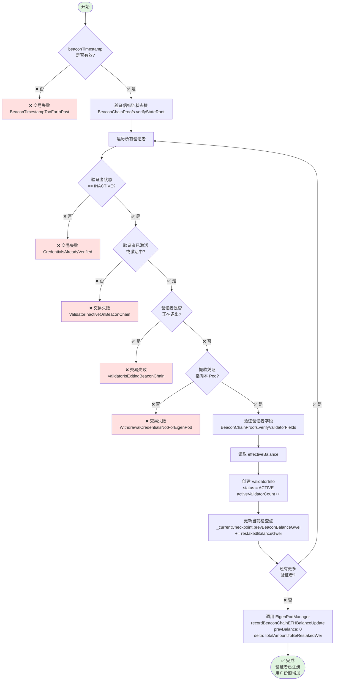
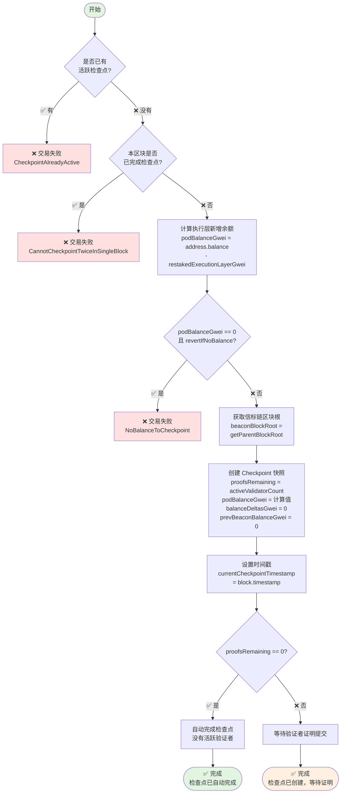
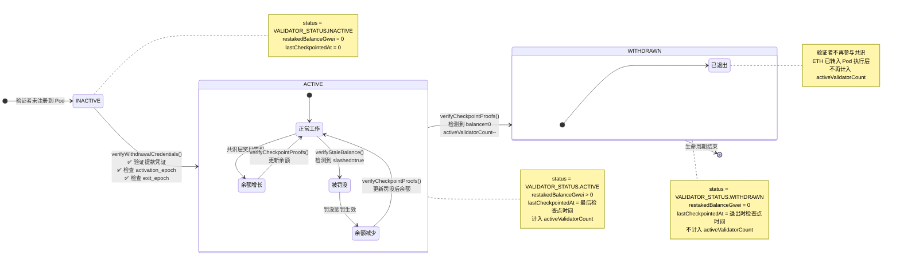
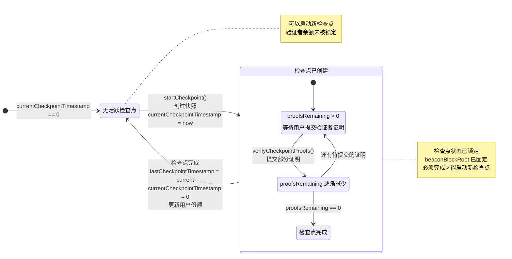

# EigenPod Checkpoint 机制详解

> 本文档详细讲解 EigenPod 中 Checkpoint（检查点）机制的工作原理、核心函数实现和完整案例演示。

## 目录

- [概述](#概述)
- [执行层与共识层](#执行层与共识层)
- [核心数据结构](#核心数据结构)
- [三个核心函数详解](#三个核心函数详解)
  - [verifyWithdrawalCredentials](#1-verifywithdrawalcredentials---验证提款凭证)
  - [startCheckpoint](#2-startcheckpoint---启动检查点)
  - [verifyCheckpointProofs](#3-verifycheckpointproofs---验证检查点证明)
- [完整案例演示](#完整案例演示)
- [状态转换图](#状态转换图)
- [关键设计要点](#关键设计要点)

---

## 概述

### 什么是 Checkpoint？

**Checkpoint（检查点）** 是 EigenPod 用于同步验证者余额状态的快照机制。它确保链上记录的验证者余额与信标链（Beacon Chain）实际余额保持一致。

### 为什么需要 Checkpoint？

由于以太坊合并后采用了双层架构（执行层 + 共识层），验证者的余额分散在两个层级：

1. **共识层余额**：验证者在信标链的质押本金和共识奖励
2. **执行层余额**：验证者的 MEV 收入、优先费和部分提款

EigenPod 必须同时追踪这两层的余额变化，而 Checkpoint 机制就是实现这一目标的核心工具。

### Checkpoint 的作用

- 📊 **余额同步**：将信标链的验证者余额变化同步到 EigenLayer
- 💰 **执行层计入**：将 Pod 合约中累积的 ETH 计入用户份额
- 🔍 **状态更新**：检测验证者的退出、罚没等状态变化
- ✅ **份额结算**：完成检查点后，更新用户在 EigenLayer 的可提取份额

---

## 执行层与共识层

### 以太坊的双层架构

| 维度 | 执行层 (Execution Layer) | 共识层 (Consensus Layer) |
|------|-------------------------|--------------------------|
| **原名称** | 以太坊 1.0 / 主网 | 信标链 / Beacon Chain |
| **共识机制** | 无（跟随共识层） | PoS (Gasper = Casper FFG + LMD GHOST) |
| **区块时间** | 12 秒 | 12 秒 (1 slot) |
| **验证者** | 无直接概念 | 32 ETH 质押的验证者 |
| **余额存储** | Wei (10^18) | Gwei (10^9) |
| **状态数据** | 账户余额、合约存储、代码 | 验证者状态、余额、证明 |
| **交易类型** | 转账、合约调用、ERC20 等 | 存款、退出、罚没 |
| **奖励来源** | Gas 费、MEV | 区块提议、证明、同步委员会 |
| **数据访问** | 直接读取（Solidity） | 需要证明（Merkle Proof） |

### 在 EigenPod 中的体现

#### 执行层余额

```solidity
// EigenPod.sol:581
uint64 podBalanceGwei = uint64(address(this).balance / GWEI_TO_WEI)
                      - restakedExecutionLayerGwei;
```

- `address(this).balance`：Pod 合约在执行层的 ETH 余额
- **来源**：
  - 验证者的执行层奖励（MEV、优先费）
  - 部分提款到 Pod 的资金
  - 直接发送到 Pod 的 ETH

#### 共识层余额

```solidity
// EigenPod.sol:475 - verifyWithdrawalCredentials 中
uint64 restakedBalanceGwei = validatorFields.getEffectiveBalanceGwei();

// EigenPod.sol:520-524 - verifyCheckpointProofs 中
uint64 newBalanceGwei = BeaconChainProofs.verifyValidatorBalance({
    balanceContainerRoot: balanceContainerRoot,
    validatorIndex: uint40(validatorInfo.validatorIndex),
    proof: proof
});
```

- 从信标链验证者字段读取的余额
- **来源**：
  - 32 ETH 初始质押
  - 信标链区块提议奖励
  - 证明奖励
  - 罚没惩罚（如果有）

### 数据可访问性差异

**执行层**：
```solidity
// ✅ 可以直接读取
uint256 balance = address(this).balance;
```

**共识层**：
```solidity
// ❌ 无法直接读取共识层数据
// uint256 validatorBalance = beacon.getValidatorBalance(index);  // 不存在

// ✅ 必须通过 EIP-4788 + Merkle 证明
bytes32 beaconBlockRoot = BEACON_ROOTS_ADDRESS.staticcall(abi.encode(timestamp));
BeaconChainProofs.verifyValidatorBalance(proof);  // 需要链下生成证明
```

### EIP-4788 的作用

**EIP-4788** 是连接执行层和共识层的桥梁：

```solidity
// EigenPod.sol:34-36
address internal constant BEACON_ROOTS_ADDRESS = 0x000F3df6D732807Ef1319fB7B8bB8522d0Beac02;

function getParentBlockRoot(uint64 timestamp) public view returns (bytes32) {
    // 从执行层合约读取共识层的区块根
    (bool success, bytes memory result) =
        BEACON_ROOTS_ADDRESS.staticcall(abi.encode(timestamp));

    return abi.decode(result, (bytes32));  // 返回信标链区块根哈希
}
```

**工作原理**：
1. 执行层每个区块头包含 `parent_beacon_block_root` 字段
2. EIP-4788 预部署合约存储最近 8191 个区块的信标链根
3. EigenPod 通过这个根验证链下生成的 Merkle 证明

---

## 核心数据结构

### Checkpoint 结构体

```solidity
struct Checkpoint {
    bytes32 beaconBlockRoot;        // 用于验证证明的信标链区块根
    uint24 proofsRemaining;         // 待提交的证明数量
    uint64 podBalanceGwei;          // Pod 中待分配的 ETH 余额（执行层）
    int64 balanceDeltasGwei;        // 验证者余额变化总和（共识层）
    uint64 prevBeaconBalanceGwei;   // 之前的信标链余额总和
}
```

**字段说明**：

- **beaconBlockRoot**：通过 EIP-4788 获取的信标链区块根，作为所有 Merkle 证明的验证基准
- **proofsRemaining**：初始值为 `activeValidatorCount`，每提交一个验证者的证明减 1，减到 0 时检查点自动完成
- **podBalanceGwei**：检查点启动时的 Pod 执行层余额快照，完成后会被计入份额
- **balanceDeltasGwei**：所有验证者的余额变化累加值（可正可负）
- **prevBeaconBalanceGwei**：所有验证者上次记录的余额总和，用于计算总变化

### ValidatorInfo 结构体

```solidity
struct ValidatorInfo {
    uint64 validatorIndex;          // 验证者在信标链的索引
    uint64 restakedBalanceGwei;     // 上次记录的余额
    uint64 lastCheckpointedAt;      // 最后一次检查点时间戳
    VALIDATOR_STATUS status;        // 验证者状态
}

enum VALIDATOR_STATUS {
    INACTIVE,   // 未注册到 Pod
    ACTIVE,     // 已激活，可参与检查点
    WITHDRAWN   // 已退出，余额为 0
}
```

### 状态变量

```solidity
// EigenPod.sol
mapping(bytes32 => ValidatorInfo) internal _validatorPubkeyHashToInfo;  // 验证者信息映射
uint64 public activeValidatorCount;                                     // 活跃验证者数量
uint64 public currentCheckpointTimestamp;                               // 当前检查点时间戳（0 表示无活跃检查点）
uint64 public lastCheckpointTimestamp;                                  // 上次完成的检查点时间戳
uint64 public restakedExecutionLayerGwei;                               // 已计入份额的执行层余额
Checkpoint internal _currentCheckpoint;                                 // 当前检查点快照
mapping(uint64 => uint64) public checkpointBalanceExitedGwei;          // 每个检查点中退出验证者的余额
```

---

## 三个核心函数详解

### 1. verifyWithdrawalCredentials - 验证提款凭证

**函数签名**：
```solidity
function verifyWithdrawalCredentials(
    uint64 beaconTimestamp,
    BeaconChainProofs.StateRootProof calldata stateRootProof,
    uint40[] calldata validatorIndices,
    bytes[] calldata validatorFieldsProofs,
    bytes32[][] calldata validatorFields
) external onlyOwnerOrProofSubmitter onlyWhenNotPaused(PAUSED_EIGENPODS_VERIFY_CREDENTIALS)
```

**作用**：首次将信标链验证者注册到 EigenPod，证明其提款凭证指向该 Pod

**执行流程**：



**关键代码**：

```solidity
// EigenPod.sol:189-236
function verifyWithdrawalCredentials(...) external {
    // 1. 时间戳检查（必须晚于当前检查点）
    require(beaconTimestamp > currentCheckpointTimestamp,
            BeaconTimestampTooFarInPast());
    require(beaconTimestamp > lastCheckpointTimestamp,
            BeaconTimestampBeforeLatestCheckpoint());

    // 2. 验证信标链状态根
    BeaconChainProofs.verifyStateRoot({
        beaconBlockRoot: getParentBlockRoot(beaconTimestamp),
        proof: stateRootProof
    });

    // 3. 遍历验证每个验证者
    uint256 totalAmountToBeRestakedWei;
    for (uint256 i = 0; i < validatorIndices.length; i++) {
        totalAmountToBeRestakedWei += _verifyWithdrawalCredentials(
            beaconTimestamp,
            stateRootProof.beaconStateRoot,
            validatorIndices[i],
            validatorFieldsProofs[i],
            validatorFields[i]
        );
    }

    // 4. 通知 EigenPodManager 增加份额
    eigenPodManager.recordBeaconChainETHBalanceUpdate({
        podOwner: podOwner,
        prevRestakedBalanceWei: 0,  // 首次验证，之前余额为 0
        balanceDeltaWei: int256(totalAmountToBeRestakedWei)
    });
}
```

**_verifyWithdrawalCredentials 内部逻辑**：

```solidity
// EigenPod.sol:411-510
function _verifyWithdrawalCredentials(...) internal returns (uint256) {
    bytes32 pubkeyHash = validatorFields.getPubkeyHash();
    ValidatorInfo memory validatorInfo = _validatorPubkeyHashToInfo[pubkeyHash];

    // 1. 状态检查
    require(validatorInfo.status == VALIDATOR_STATUS.INACTIVE,
            CredentialsAlreadyVerified());

    // 2. 验证者必须已激活（或激活中）
    require(validatorFields.getActivationEpoch() != FAR_FUTURE_EPOCH,
            ValidatorInactiveOnBeaconChain());

    // 3. 验证者不能正在退出
    require(validatorFields.getExitEpoch() == FAR_FUTURE_EPOCH,
            ValidatorIsExitingBeaconChain());

    // 4. 验证提款凭证指向本 Pod（支持 0x01 和 0x02 两种类型）
    require(
        validatorFields.getWithdrawalCredentials() == bytes32(_podWithdrawalCredentials())
        || validatorFields.getWithdrawalCredentials() == bytes32(_podCompoundingWithdrawalCredentials()),
        WithdrawalCredentialsNotForEigenPod()
    );

    // 5. 验证信标链证明
    BeaconChainProofs.verifyValidatorFields({
        proofVersion: _getProofVersion(beaconTimestamp),
        beaconStateRoot: beaconStateRoot,
        validatorFields: validatorFields,
        validatorFieldsProof: validatorFieldsProof,
        validatorIndex: validatorIndex
    });

    // 6. 读取验证者的有效余额
    uint64 restakedBalanceGwei = validatorFields.getEffectiveBalanceGwei();

    // 7. 创建验证者记录
    activeValidatorCount++;
    uint64 lastCheckpointedAt = currentCheckpointTimestamp == 0
        ? lastCheckpointTimestamp
        : currentCheckpointTimestamp;

    _validatorPubkeyHashToInfo[pubkeyHash] = ValidatorInfo({
        validatorIndex: validatorIndex,
        restakedBalanceGwei: restakedBalanceGwei,
        lastCheckpointedAt: lastCheckpointedAt,
        status: VALIDATOR_STATUS.ACTIVE
    });

    // 8. 将余额加入当前检查点
    _currentCheckpoint.prevBeaconBalanceGwei += restakedBalanceGwei;

    emit ValidatorRestaked(pubkeyHash);
    return restakedBalanceGwei * GWEI_TO_WEI;
}
```

**关键点**：
- **首次注册**：将 `INACTIVE` 验证者激活为 `ACTIVE` 状态
- **双重凭证支持**：支持 0x01（普通提款）和 0x02（复合提款）两种凭证类型
- **防退出验证者**：拒绝已经开始退出流程的验证者（通过 EIP-4788 的 8192 slot 窗口保证）
- **立即增加份额**：验证通过后立即调用 `EigenPodManager.recordBeaconChainETHBalanceUpdate` 增加用户份额
- **使用有效余额**：使用 `effectiveBalance`（每 epoch 更新）而非 `currentBalance`（实时）

---

### 2. startCheckpoint - 启动检查点

**函数签名**：
```solidity
function startCheckpoint(
    bool revertIfNoBalance
) external onlyOwnerOrProofSubmitter onlyWhenNotPaused(PAUSED_START_CHECKPOINT)
```

**作用**：创建一个新的 Checkpoint 快照，记录当前时刻的状态

**执行流程**：



**关键代码**：

```solidity
// EigenPod.sol:560-605
function _startCheckpoint(bool revertIfNoBalance) internal {
    // 1. 前置检查
    require(currentCheckpointTimestamp == 0, CheckpointAlreadyActive());
    require(lastCheckpointTimestamp != uint64(block.timestamp),
            CannotCheckpointTwiceInSingleBlock());

    // 2. 计算待分配的 Pod 余额（单位：gwei）
    uint64 podBalanceGwei = uint64(address(this).balance / GWEI_TO_WEI)
                          - restakedExecutionLayerGwei;

    // 3. 如果调用者不想要"0 余额"检查点，则 revert
    if (revertIfNoBalance && podBalanceGwei == 0) {
        revert NoBalanceToCheckpoint();
    }

    // 4. 创建 Checkpoint 快照
    Checkpoint memory checkpoint = Checkpoint({
        beaconBlockRoot: getParentBlockRoot(uint64(block.timestamp)),  // 使用前一个区块根
        proofsRemaining: uint24(activeValidatorCount),  // 需要证明的活跃验证者数量
        podBalanceGwei: podBalanceGwei,
        balanceDeltasGwei: 0,
        prevBeaconBalanceGwei: 0
    });

    // 5. 存储到状态变量
    currentCheckpointTimestamp = uint64(block.timestamp);
    _updateCheckpoint(checkpoint);

    emit CheckpointCreated(uint64(block.timestamp), checkpoint.beaconBlockRoot, checkpoint.proofsRemaining);
}
```

**关键点**：
- **快照 Pod 余额**：记录当前 Pod 中未被计入份额的 ETH（执行层余额）
- **记录活跃验证者数量**：`proofsRemaining` 初始化为活跃验证者数，每提交一个证明减 1
- **区块根锚定**：使用 `getParentBlockRoot()` 获取前一个区块的信标链根，作为后续证明的基准
- **自动完成**：如果 `proofsRemaining == 0`（无活跃验证者），检查点立即完成
- **防止双重检查点**：同一个区块不能完成两次检查点，防止 `lastCheckpointedAt` 冲突

---

### 3. verifyCheckpointProofs - 验证检查点证明

**函数签名**：
```solidity
function verifyCheckpointProofs(
    BeaconChainProofs.BalanceContainerProof calldata balanceContainerProof,
    BeaconChainProofs.BalanceProof[] calldata proofs
) external onlyWhenNotPaused(PAUSED_EIGENPODS_VERIFY_CHECKPOINT_PROOFS)
```

**作用**：为 Checkpoint 中的验证者提交余额证明，更新其在信标链的余额状态

**执行流程**：

```mermaid
flowchart TD
    Start([开始]) --> CheckActive{是否有<br/>活跃检查点?}
    CheckActive -->|❌ 否| Error1[❌ 交易失败<br/>NoActiveCheckpoint]
    CheckActive -->|✅ 是| VerifyContainer[验证 BalanceContainer 证明<br/>BeaconChainProofs.verifyBalanceContainer]

    VerifyContainer --> LoopStart[遍历所有验证者证明]
    LoopStart --> GetValidatorInfo[读取 ValidatorInfo]

    GetValidatorInfo --> CheckStatus{status == ACTIVE?}
    CheckStatus -->|❌ 否| Skip1[跳过该验证者<br/>continue]
    CheckStatus -->|✅ 是| CheckTimestamp{lastCheckpointedAt<br/>>= checkpointTimestamp?}

    CheckTimestamp -->|✅ 是| Skip2[跳过该验证者<br/>已在本检查点证明过]
    CheckTimestamp -->|❌ 否| VerifyBalance[验证余额证明<br/>BeaconChainProofs.verifyValidatorBalance]

    VerifyBalance --> CalcDelta[计算余额变化<br/>balanceDeltaGwei =<br/>newBalance - prevBalance]

    CalcDelta --> CheckZeroBalance{newBalance == 0?}
    CheckZeroBalance -->|✅ 是| MarkWithdrawn[标记为已退出<br/>status = WITHDRAWN<br/>activeValidatorCount--<br/>exitedBalanceGwei += oldBalance]
    CheckZeroBalance -->|❌ 否| UpdateBalance[更新余额<br/>restakedBalanceGwei = newBalance<br/>lastCheckpointedAt = timestamp]

    MarkWithdrawn --> Accumulate[累积统计数据<br/>proofsRemaining--<br/>prevBeaconBalanceGwei += prevBalance<br/>balanceDeltasGwei += delta]
    UpdateBalance --> Accumulate

    Accumulate --> SaveValidator[保存 ValidatorInfo 到 state]

    SaveValidator --> MoreProofs{还有更多<br/>证明?}
    MoreProofs -->|✅ 是| LoopStart
    MoreProofs -->|❌ 否| UpdateExited[更新退出余额<br/>checkpointBalanceExitedGwei<br/>[timestamp] += exitedBalancesGwei]

    UpdateExited --> UpdateCheckpoint[调用 _updateCheckpoint]

    UpdateCheckpoint --> CheckComplete{proofsRemaining == 0?}
    CheckComplete -->|❌ 否| WaitMore([⏳ 等待更多证明])
    CheckComplete -->|✅ 是| CalcTotal[计算总变化<br/>prevRestakedBalanceGwei =<br/>restakedExecutionLayerGwei<br/>+ prevBeaconBalanceGwei<br/><br/>balanceDeltaGwei =<br/>podBalanceGwei<br/>+ balanceDeltasGwei]

    CalcTotal --> UpdateRestaked[更新执行层余额<br/>restakedExecutionLayerGwei<br/>+= podBalanceGwei]

    UpdateRestaked --> ClearTimestamp[完成检查点<br/>lastCheckpointTimestamp<br/>= currentCheckpointTimestamp<br/>delete currentCheckpointTimestamp]

    ClearTimestamp --> RecordBalance[调用 EigenPodManager<br/>recordBeaconChainETHBalanceUpdate<br/>prevBalance: prevRestakedBalanceWei<br/>delta: balanceDeltaWei]

    RecordBalance --> End([✅ 完成<br/>检查点已完成<br/>用户份额已更新])

    Skip1 --> MoreProofs
    Skip2 --> MoreProofs

    style Start fill:#e1f5e1
    style End fill:#e1f5e1
    style WaitMore fill:#fff0e1
    style Error1 fill:#ffe0e0
```

**关键代码**：

```solidity
// EigenPod.sol:124-186
function verifyCheckpointProofs(
    BeaconChainProofs.BalanceContainerProof calldata balanceContainerProof,
    BeaconChainProofs.BalanceProof[] calldata proofs
) external {
    uint64 checkpointTimestamp = currentCheckpointTimestamp;
    require(checkpointTimestamp != 0, NoActiveCheckpoint());

    Checkpoint memory checkpoint = _currentCheckpoint;

    // 1. 验证余额容器证明（一次性验证）
    BeaconChainProofs.verifyBalanceContainer({
        proofVersion: _getProofVersion(checkpointTimestamp),
        beaconBlockRoot: checkpoint.beaconBlockRoot,
        proof: balanceContainerProof
    });

    // 2. 遍历处理每个验证者的余额证明
    uint64 exitedBalancesGwei;
    for (uint256 i = 0; i < proofs.length; i++) {
        BeaconChainProofs.BalanceProof calldata proof = proofs[i];
        ValidatorInfo memory validatorInfo = _validatorPubkeyHashToInfo[proof.pubkeyHash];

        // 跳过非活跃或已证明的验证者
        if (validatorInfo.status != VALIDATOR_STATUS.ACTIVE) continue;
        if (validatorInfo.lastCheckpointedAt >= checkpointTimestamp) continue;

        // 3. 验证单个验证者的余额证明
        (uint64 prevBalanceGwei, int64 balanceDeltaGwei, uint64 exitedBalanceGwei) =
            _verifyCheckpointProof({
                validatorInfo: validatorInfo,
                checkpointTimestamp: checkpointTimestamp,
                balanceContainerRoot: balanceContainerProof.balanceContainerRoot,
                proof: proof
            });

        // 4. 累积统计数据
        checkpoint.proofsRemaining--;
        checkpoint.prevBeaconBalanceGwei += prevBalanceGwei;
        checkpoint.balanceDeltasGwei += balanceDeltaGwei;
        exitedBalancesGwei += exitedBalanceGwei;

        // 5. 更新验证者状态
        _validatorPubkeyHashToInfo[proof.pubkeyHash] = validatorInfo;
        emit ValidatorCheckpointed(checkpointTimestamp, proof.pubkeyHash);
    }

    // 6. 更新 Checkpoint（如果 proofsRemaining == 0 则自动完成）
    checkpointBalanceExitedGwei[checkpointTimestamp] += exitedBalancesGwei;
    _updateCheckpoint(checkpoint);
}
```

**_verifyCheckpointProof 内部逻辑**：

```solidity
// EigenPod.sol:512-547
function _verifyCheckpointProof(...) internal returns (
    uint64 prevBalanceGwei,
    int64 balanceDeltaGwei,
    uint64 exitedBalanceGwei
) {
    // 1. 获取旧余额
    prevBalanceGwei = validatorInfo.restakedBalanceGwei;

    // 2. 从信标链证明中读取新余额
    uint64 newBalanceGwei = BeaconChainProofs.verifyValidatorBalance({
        balanceContainerRoot: balanceContainerRoot,
        validatorIndex: uint40(validatorInfo.validatorIndex),
        proof: proof
    });

    // 3. 计算余额变化
    if (newBalanceGwei != prevBalanceGwei) {
        balanceDeltaGwei = int64(newBalanceGwei) - int64(prevBalanceGwei);
        emit ValidatorBalanceUpdated(proof.pubkeyHash, checkpointTimestamp, newBalanceGwei);
    }

    // 4. 更新验证者信息
    validatorInfo.restakedBalanceGwei = newBalanceGwei;
    validatorInfo.lastCheckpointedAt = checkpointTimestamp;

    // 5. 如果余额为 0，标记为已退出
    if (newBalanceGwei == 0) {
        activeValidatorCount--;
        validatorInfo.status = VALIDATOR_STATUS.WITHDRAWN;
        exitedBalanceGwei = uint64(-balanceDeltaGwei);
        emit ValidatorWithdrawn(checkpointTimestamp, proof.pubkeyHash);
    }

    return (prevBalanceGwei, balanceDeltaGwei, exitedBalanceGwei);
}
```

**_updateCheckpoint 完成逻辑**：

```solidity
// EigenPod.sol:613-647
function _updateCheckpoint(Checkpoint memory checkpoint) internal {
    _currentCheckpoint = checkpoint;

    // 如果还有待提交的证明，直接返回
    if (checkpoint.proofsRemaining != 0) {
        return;
    }

    // 计算之前的总余额和变化量
    uint64 prevRestakedBalanceGwei = restakedExecutionLayerGwei + checkpoint.prevBeaconBalanceGwei;
    int64 balanceDeltaGwei = int64(checkpoint.podBalanceGwei) + checkpoint.balanceDeltasGwei;

    // 将执行层余额标记为"已计入份额"
    restakedExecutionLayerGwei += checkpoint.podBalanceGwei;

    // 完成检查点
    lastCheckpointTimestamp = currentCheckpointTimestamp;
    delete currentCheckpointTimestamp;

    // 转换为 wei 并通知 EigenPodManager
    uint256 prevRestakedBalanceWei = prevRestakedBalanceGwei * GWEI_TO_WEI;
    int256 balanceDeltaWei = balanceDeltaGwei * int256(GWEI_TO_WEI);

    emit CheckpointFinalized(lastCheckpointTimestamp, balanceDeltaWei);
    eigenPodManager.recordBeaconChainETHBalanceUpdate({
        podOwner: podOwner,
        prevRestakedBalanceWei: prevRestakedBalanceWei,
        balanceDeltaWei: balanceDeltaWei
    });
}
```

**关键点**：
- **批量验证**：可以一次提交多个验证者的证明（gas 优化）
- **余额对账**：比较上次检查点的余额与当前信标链余额，计算 delta
- **自动退出检测**：余额为 0 的验证者自动标记为 `WITHDRAWN` 状态
- **防重复验证**：通过 `lastCheckpointedAt` 防止同一验证者在同一检查点被重复证明
- **跳过而非 revert**：使用 `continue` 跳过无效验证者，避免单个无效证明导致整个交易失败

---

## 完整案例演示

### 案例背景

**Alice** 拥有 64 ETH，质押了 2 个验证者（Validator A 和 Validator B），经历了：
1. 首次注册验证者
2. 6 个月的奖励累积
3. 启动并完成检查点
4. Validator B 被罚没
5. Validator B 退出
6. Alice 提款 30 ETH

### 数据追踪表

| 时间点 | 事件 | Validator A<br/>(共识层) | Validator B<br/>(共识层) | Pod Balance<br/>(执行层) | restaked<br/>Execution<br/>LayerGwei | active<br/>Validator<br/>Count | Alice<br/>份额 | 变化说明 |
|--------|------|----------|----------|----------|----------|----------|--------|---------|
| **Day 0** | 🔷 质押 | 32 ETH | 32 ETH | 0 | 0 | 0 | **0** | 初始质押到信标链 |
| **Day 1** | 🔷 验证凭证 | 32 ETH<br/>✅ ACTIVE | 32 ETH<br/>✅ ACTIVE | 0 | 0 | 2 | **64 ETH** | 首次注册,立即获得份额 |
| **Day 180** | 📊 奖励累积 | 33.2 ETH<br/>(+1.2) | 33.5 ETH<br/>(+1.5) | 1.8 ETH | 0 | 2 | 64 ETH | ⚠️ 份额未同步 |
| **Day 180** | 🔷 完成检查点 | 33.2 ETH | 33.5 ETH | 1.8 ETH | **1.8 ETH** | 2 | **68.5 ETH** | +4.5 ETH (1.8执行+2.7共识) |
| **Day 200** | ⚠️ B 被罚没 | 33.8 ETH<br/>(+0.6) | 31.8 ETH<br/>🚨 SLASHED<br/>(-1.7) | 1.8 ETH | 1.8 ETH | 2 | **67.4 ETH** | -1.1 ETH 罚没损失 |
| **Day 260** | 🚪 B 退出到 Pod | 34.2 ETH | 0 ETH<br/>⏳ 退出中 | **33.6 ETH** | 1.8 ETH | 2 | 67.4 ETH | 31.8 ETH 转入 Pod |
| **Day 261** | 🔷 更新退出状态 | 34.2 ETH | 0 ETH<br/>🚫 WITHDRAWN | 33.6 ETH | **33.6 ETH** | **1** | **67.8 ETH** | +0.4 ETH (仅 A 增长) |
| **Day 269** | 💰 提款完成 | 34.2 ETH | 0 ETH | **3.6 ETH** | **3.6 ETH** | 1 | **37.8 ETH** | Alice 提走 30 ETH |

### 关键时刻详解

#### 阶段 2: verifyWithdrawalCredentials (Day 1)

```solidity
// Alice 调用
pod.verifyWithdrawalCredentials(
    beaconTimestamp: Day 1,
    validatorIndices: [1234, 5678],  // A 和 B 的索引
    validatorFields: [
        [32 ETH, 0x01...Pod地址, ...],  // A 的字段
        [32 ETH, 0x01...Pod地址, ...]   // B 的字段
    ]
);

// 内部执行
for (uint i = 0; i < 2; i++) {
    uint64 restakedBalanceGwei = validatorFields[i].getEffectiveBalanceGwei();  // 32 ETH

    _validatorPubkeyHashToInfo[pubkeyHash] = ValidatorInfo({
        validatorIndex: validatorIndices[i],
        restakedBalanceGwei: 32 * 1e9,  // 32 ETH in gwei
        lastCheckpointedAt: 0,
        status: VALIDATOR_STATUS.ACTIVE  // ✅ 激活
    });

    activeValidatorCount++;  // 0 → 1 → 2
    totalAmountToBeRestakedWei += 32 ether;
}

// 通知 EigenPodManager
eigenPodManager.recordBeaconChainETHBalanceUpdate(
    podOwner: Alice,
    prevRestakedBalanceWei: 0,
    balanceDeltaWei: +64 ether  // 立即增加 64 ETH 份额
);
```

**结果**：
- ✅ activeValidatorCount: 0 → 2
- ✅ Alice 份额: 0 → 64 ETH
- ✅ 验证者状态: INACTIVE → ACTIVE

#### 阶段 4: startCheckpoint (Day 180)

```solidity
// Day 180 时刻
// Pod 余额: 1.8 ETH (执行层奖励)
// restakedExecutionLayerGwei: 0 (还未计入份额)

pod.startCheckpoint(false);

// 内部执行
uint64 podBalanceGwei = uint64(address(this).balance / GWEI_TO_WEI)
                      - restakedExecutionLayerGwei;
// = uint64(1.8 ether / 1e9) - 0
// = 1800000000 gwei (1.8 ETH)

Checkpoint memory checkpoint = Checkpoint({
    beaconBlockRoot: 0xabc123...,  // 通过 EIP-4788 读取
    proofsRemaining: 2,  // activeValidatorCount
    podBalanceGwei: 1800000000,  // 1.8 ETH
    balanceDeltasGwei: 0,
    prevBeaconBalanceGwei: 0
});

currentCheckpointTimestamp = block.timestamp;  // Day 180
```

**结果**：
- ✅ 检查点已创建
- ✅ 锁定 Pod 余额: 1.8 ETH
- ✅ 等待 2 个验证者证明

#### 阶段 5: verifyCheckpointProofs (Day 180)

```solidity
pod.verifyCheckpointProofs(
    balanceContainerProof: {...},  // 容器证明（一次性）
    proofs: [proofA, proofB]       // 每个验证者的证明
);

// 处理 Validator A
ValidatorInfo memory infoA = _validatorPubkeyHashToInfo[hashA];
// infoA.restakedBalanceGwei = 32 * 1e9 (上次的余额)

uint64 newBalanceA = BeaconChainProofs.verifyValidatorBalance(...);
// = 33.2 * 1e9 gwei

int64 deltaA = int64(newBalanceA) - int64(infoA.restakedBalanceGwei);
// = int64(33.2e9) - int64(32e9) = +1.2e9 gwei (+1.2 ETH)

checkpoint.prevBeaconBalanceGwei += 32e9;  // 0 → 32e9
checkpoint.balanceDeltasGwei += deltaA;    // 0 → +1.2e9
checkpoint.proofsRemaining--;               // 2 → 1

// 处理 Validator B
uint64 newBalanceB = 33.5 * 1e9;
int64 deltaB = +1.5e9;  // +1.5 ETH

checkpoint.prevBeaconBalanceGwei += 32e9;  // 32e9 → 64e9
checkpoint.balanceDeltasGwei += deltaB;    // +1.2e9 → +2.7e9
checkpoint.proofsRemaining--;               // 1 → 0

// ✅ proofsRemaining == 0，自动完成检查点
_updateCheckpoint(checkpoint);

// 计算总变化
uint64 prevRestakedBalanceGwei = restakedExecutionLayerGwei + checkpoint.prevBeaconBalanceGwei;
// = 0 + 64e9 = 64e9 gwei (64 ETH)

int64 balanceDeltaGwei = int64(checkpoint.podBalanceGwei) + checkpoint.balanceDeltasGwei;
// = int64(1.8e9) + 2.7e9 = 4.5e9 gwei (+4.5 ETH)

restakedExecutionLayerGwei += checkpoint.podBalanceGwei;
// = 0 + 1.8e9 = 1.8e9 (将执行层余额标记为"已计入份额")

eigenPodManager.recordBeaconChainETHBalanceUpdate(
    podOwner: Alice,
    prevRestakedBalanceWei: 64 ether,
    balanceDeltaWei: +4.5 ether  // Alice 份额: 64 → 68.5 ETH
);
```

**结果**：
- ✅ 检查点已完成
- ✅ restakedExecutionLayerGwei: 0 → 1.8 ETH
- ✅ Alice 份额: 64 → 68.5 ETH
- ✅ Validator A 余额更新: 32 → 33.2 ETH
- ✅ Validator B 余额更新: 32 → 33.5 ETH

#### 阶段 9: 处理退出验证者 (Day 261)

```solidity
// Day 261
// Pod 余额: 33.6 ETH (1.8 旧 + 31.8 退出转入)
// restakedExecutionLayerGwei: 1.8e9

pod.startCheckpoint(false);
uint64 podBalanceGwei = uint64(33.6 ether / 1e9) - 1.8e9 = 31.8e9;
// ↑ 新增的 31.8 ETH (B 退出的资金)

pod.verifyCheckpointProofs([proofA, proofB]);

// Validator A
uint64 newBalanceA = 34.2e9;  // +0.4 ETH
int64 deltaA = +0.4e9;

// Validator B
uint64 newBalanceB = 0;  // 已退出
int64 deltaB = int64(0) - int64(31.8e9) = -31.8e9;  // -31.8 ETH

if (newBalanceB == 0) {
    activeValidatorCount--;  // 2 → 1
    validatorInfo[B].status = VALIDATOR_STATUS.WITHDRAWN;  // 标记为已退出
    exitedBalanceGwei = uint64(-deltaB) = 31.8e9;
}

// 总变化计算
int64 totalDelta = int64(31.8e9) + 0.4e9 - 31.8e9 = +0.4e9;
// ↑ 执行层新增    ↑ A增长  ↑ B退出抵消

// Alice 份额: 67.4 → 67.8 ETH (仅增加 A 的 0.4 ETH)
```

**结果**：
- ✅ Validator B 标记为 WITHDRAWN
- ✅ activeValidatorCount: 2 → 1
- ✅ restakedExecutionLayerGwei: 1.8 → 33.6 ETH
- ✅ Alice 份额: 67.4 → 67.8 ETH

---

## 状态转换图

### Validator 生命周期状态机



### Checkpoint 生命周期



---

## 关键设计要点

### 1. 两阶段余额更新

| 阶段 | 函数 | 余额来源 | 精度 | 时机 |
|------|------|---------|------|------|
| **首次注册** | verifyWithdrawalCredentials | effectiveBalance | 粗略（epoch 级别） | 验证者激活后 |
| **定期更新** | verifyCheckpointProofs | currentBalance | 精确（slot 级别） | 完整检查点 |

**为什么需要两阶段？**
- **effectiveBalance**：每个 epoch（6.4 分钟）更新一次，精度较低，但可以快速验证
- **currentBalance**：实时余额，精度高，但需要完整的检查点流程

### 2. 时间戳约束

```solidity
// verifyWithdrawalCredentials 必须使用未来时间戳
beaconTimestamp > currentCheckpointTimestamp
beaconTimestamp > lastCheckpointTimestamp

// verifyStaleBalance 必须晚于上次更新
beaconTimestamp > validatorInfo.lastCheckpointedAt

// startCheckpoint 不能在同一区块完成两次
lastCheckpointTimestamp != uint64(block.timestamp)
```

**目的**：
- 防止新验证者被用于已存在的检查点
- 确保状态转换的时间顺序性
- 避免 `lastCheckpointedAt` 冲突

### 3. Gas 优化策略

#### 批量证明
```solidity
// ✅ 好：一次提交多个验证者
verifyCheckpointProofs([proofA, proofB, proofC]);

// ❌ 差：分开提交
verifyCheckpointProofs([proofA]);
verifyCheckpointProofs([proofB]);
verifyCheckpointProofs([proofC]);
```

#### 跳过无效验证者
```solidity
// 使用 continue 而非 revert
if (validatorInfo.status != VALIDATOR_STATUS.ACTIVE) {
    continue;  // ✅ 跳过，继续处理其他验证者
}

// ❌ 如果使用 revert，整个交易失败，浪费 gas
// revert ValidatorNotActive();
```

#### Sub-gwei 余额处理
```solidity
// 不到 1 gwei 的余额不计入份额
uint64 podBalanceGwei = uint64(address(this).balance / GWEI_TO_WEI);
// 例如：1.9999999999 ETH → 1 ETH (丢失 0.9999999999 gwei)
```

**建议**：用户可以向 Pod 充值少量 ETH，使余额凑整到 gwei

### 4. 安全机制

#### 防重入
```solidity
contract EigenPod is ReentrancyGuardUpgradeable {
    // 所有外部函数都受 ReentrancyGuard 保护
}
```

#### 暂停开关
```solidity
modifier onlyWhenNotPaused(uint8 index) {
    require(!IPausable(address(eigenPodManager)).paused(index), CurrentlyPaused());
    _;
}

// 每个关键函数都有对应的暂停位
// PAUSED_START_CHECKPOINT = 0
// PAUSED_EIGENPODS_VERIFY_CREDENTIALS = 1
// PAUSED_EIGENPODS_VERIFY_CHECKPOINT_PROOFS = 2
// PAUSED_VERIFY_STALE_BALANCE = 3
```

#### 防重复证明
```solidity
// 通过 lastCheckpointedAt 防止同一验证者在同一检查点被重复证明
if (validatorInfo.lastCheckpointedAt >= checkpointTimestamp) {
    continue;
}
```

#### 防止状态冲突
```solidity
// 不能在已有活跃检查点时启动新检查点
require(currentCheckpointTimestamp == 0, CheckpointAlreadyActive());

// 不能在同一区块完成两次检查点
require(lastCheckpointTimestamp != uint64(block.timestamp),
        CannotCheckpointTwiceInSingleBlock());
```

### 5. 存储优化

#### 使用 Gwei 而非 Wei
```solidity
// ✅ 使用 uint64 存储 gwei（节省 gas）
uint64 public restakedExecutionLayerGwei;

// ❌ 如果使用 wei，需要 uint256
// uint256 public restakedExecutionLayerWei;  // 浪费存储
```

**原因**：
- 1 gwei = 10^9 wei
- 信标链使用 gwei 为单位
- uint64 最大值 = 18,446,744,073 gwei ≈ 18.4 billion ETH（足够）

#### 紧凑的时间戳
```solidity
uint64 public currentCheckpointTimestamp;  // 而非 uint256
uint64 public lastCheckpointTimestamp;
```

### 6. 边界情况处理

#### 无活跃验证者的检查点
```solidity
// 如果 activeValidatorCount == 0，检查点立即完成
if (checkpoint.proofsRemaining == 0) {
    // 自动调用 _updateCheckpoint 完成
}
```

#### 罚没导致的紧急检查点
```solidity
// verifyStaleBalance 检测到罚没后自动启动检查点
function verifyStaleBalance(...) external {
    require(proof.validatorFields.isValidatorSlashed(),
            ValidatorNotSlashedOnBeaconChain());

    _startCheckpoint(false);  // 自动启动
}
```

#### 验证者余额为 0 的处理
```solidity
// 自动标记为 WITHDRAWN
if (newBalanceGwei == 0) {
    activeValidatorCount--;
    validatorInfo.status = VALIDATOR_STATUS.WITHDRAWN;
    exitedBalanceGwei = uint64(-balanceDeltaGwei);
}
```

---

## 总结

### Checkpoint 机制的核心价值

1. **准确性**：确保 EigenLayer 份额精确反映验证者在信标链的实际余额
2. **灵活性**：支持增量更新，无需每次都验证所有验证者
3. **安全性**：通过 Merkle 证明确保数据来源可信，防止作弊
4. **Gas 效率**：批量提交证明，跳过无效验证者，优化存储布局

### 三个核心函数对比

| 函数 | 触发时机 | 主要作用 | 余额来源 | 是否立即更新份额 |
|------|---------|---------|---------|-----------------|
| **verifyWithdrawalCredentials** | 首次注册验证者 | 激活验证者，立即增加份额 | effectiveBalance | ✅ 是 |
| **startCheckpoint** | 定期/罚没时 | 创建余额快照，锁定 Pod 余额 | 执行层余额 | ❌ 否 |
| **verifyCheckpointProofs** | 检查点激活后 | 更新验证者余额，完成检查点 | currentBalance | ✅ 是（完成时） |

### 完整工作流程

```
1. 质押 32 ETH 到信标链
   ↓
2. verifyWithdrawalCredentials() - 首次注册，获得初始份额
   ↓
3. 验证者工作，奖励累积（共识层 + 执行层）
   ↓
4. startCheckpoint() - 启动检查点，锁定快照
   ↓
5. verifyCheckpointProofs() - 提交证明，更新余额
   ↓
6. 检查点完成，份额更新
   ↓
7. 用户通过 DelegationManager 发起提款
   ↓
8. 延迟期后，ETH 从 Pod 转出
```

### 进一步阅读

- [EigenPod.md](./EigenPod.md) - EigenPod 完整文档
- [EigenPodManager.md](./EigenPodManager.md) - EigenPodManager 文档
- [BeaconChainProofs 库](./libraries/) - 信标链证明验证库
- [EIP-4788](https://eips.ethereum.org/EIPS/eip-4788) - 信标链区块根预言机
- [EIP-7002](https://eips.ethereum.org/EIPS/eip-7002) - 执行层触发的退出
- [EIP-7251](https://eips.ethereum.org/EIPS/eip-7251) - 验证者合并请求

---

**文档版本**: v1.0.0
**最后更新**: 2024-12-16
**适用于**: EigenLayer v1.8.1+
