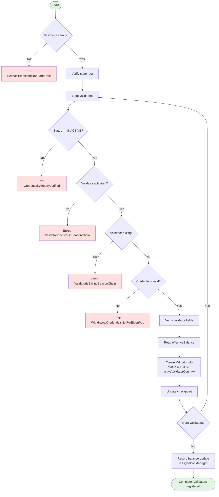
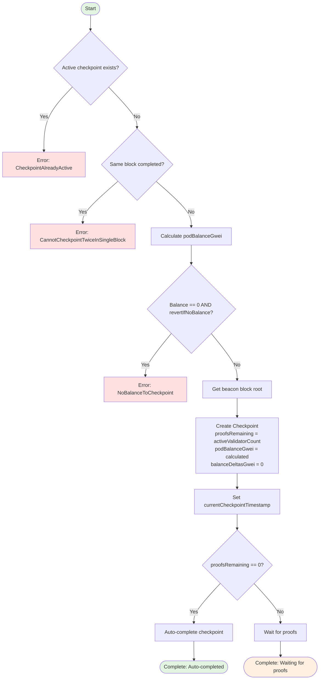
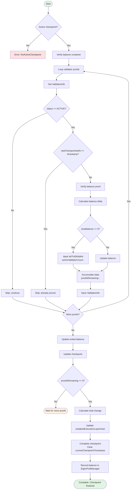
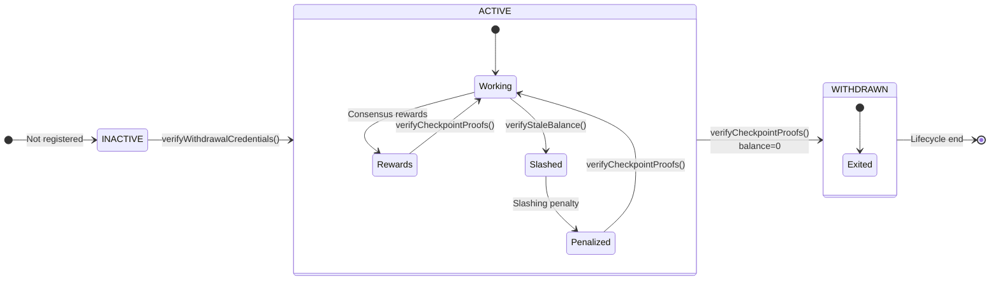
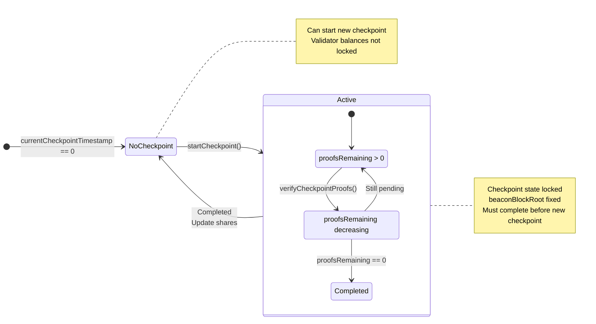

# EigenPod Checkpoint 机制详解

> 本文档详细讲解 EigenPod 中 Checkpoint（检查点）机制的工作原理、核心函数实现和完整案例演示。

## 目录

- [概述](#概述)
- [执行层与共识层](#执行层与共识层)
- [核心数据结构](#核心数据结构)
- [三个核心函数详解](#三个核心函数详解)
  - [verifyWithdrawalCredentials](#1-verifywithdrawalcredentials---验证提款凭证)
  - [startCheckpoint](#2-startcheckpoint---启动检查点)
  - [verifyCheckpointProofs](#3-verifycheckpointproofs---验证检查点证明)
- [完整案例演示](#完整案例演示)
- [状态转换图](#状态转换图)
- [关键设计要点](#关键设计要点)

---

## 概述

### 什么是 Checkpoint？

**Checkpoint（检查点）** 是 EigenPod 用于同步验证者余额状态的快照机制。它确保链上记录的验证者余额与信标链（Beacon Chain）实际余额保持一致。

### 为什么需要 Checkpoint？

由于以太坊合并后采用了双层架构（执行层 + 共识层），验证者的余额分散在两个层级：

1. **共识层余额**：验证者在信标链的质押本金和共识奖励
2. **执行层余额**：验证者的 MEV 收入、优先费和部分提款

EigenPod 必须同时追踪这两层的余额变化，而 Checkpoint 机制就是实现这一目标的核心工具。

### Checkpoint 的作用

- 📊 **余额同步**：将信标链的验证者余额变化同步到 EigenLayer
- 💰 **执行层计入**：将 Pod 合约中累积的 ETH 计入用户份额
- 🔍 **状态更新**：检测验证者的退出、罚没等状态变化
- ✅ **份额结算**：完成检查点后，更新用户在 EigenLayer 的可提取份额

---

## 执行层与共识层

### 以太坊的双层架构

| 维度 | 执行层 (Execution Layer) | 共识层 (Consensus Layer) |
|------|-------------------------|--------------------------|
| **原名称** | 以太坊 1.0 / 主网 | 信标链 / Beacon Chain |
| **共识机制** | 无（跟随共识层） | PoS (Gasper = Casper FFG + LMD GHOST) |
| **区块时间** | 12 秒 | 12 秒 (1 slot) |
| **验证者** | 无直接概念 | 32 ETH 质押的验证者 |
| **余额存储** | Wei (10^18) | Gwei (10^9) |
| **状态数据** | 账户余额、合约存储、代码 | 验证者状态、余额、证明 |
| **交易类型** | 转账、合约调用、ERC20 等 | 存款、退出、罚没 |
| **奖励来源** | Gas 费、MEV | 区块提议、证明、同步委员会 |
| **数据访问** | 直接读取（Solidity） | 需要证明（Merkle Proof） |

### 在 EigenPod 中的体现

#### 执行层余额

```solidity
// EigenPod.sol:581
uint64 podBalanceGwei = uint64(address(this).balance / GWEI_TO_WEI)
                      - restakedExecutionLayerGwei;
```

- `address(this).balance`：Pod 合约在执行层的 ETH 余额
- **来源**：
  - 验证者的执行层奖励（MEV、优先费）
  - 部分提款到 Pod 的资金
  - 直接发送到 Pod 的 ETH

#### 共识层余额

```solidity
// EigenPod.sol:475 - verifyWithdrawalCredentials 中
uint64 restakedBalanceGwei = validatorFields.getEffectiveBalanceGwei();

// EigenPod.sol:520-524 - verifyCheckpointProofs 中
uint64 newBalanceGwei = BeaconChainProofs.verifyValidatorBalance({
    balanceContainerRoot: balanceContainerRoot,
    validatorIndex: uint40(validatorInfo.validatorIndex),
    proof: proof
});
```

- 从信标链验证者字段读取的余额
- **来源**：
  - 32 ETH 初始质押
  - 信标链区块提议奖励
  - 证明奖励
  - 罚没惩罚（如果有）

### 数据可访问性差异

**执行层**：
```solidity
// OK: Can directly read
uint256 balance = address(this).balance;
```

**共识层**：
```solidity
// FAIL: Cannot directly read consensus layer data
// uint256 validatorBalance = beacon.getValidatorBalance(index);

// OK: Must use EIP-4788 + Merkle proof
bytes32 beaconBlockRoot = BEACON_ROOTS_ADDRESS.staticcall(abi.encode(timestamp));
BeaconChainProofs.verifyValidatorBalance(proof);
```

### EIP-4788 的作用

**EIP-4788** 是连接执行层和共识层的桥梁：

```solidity
// EigenPod.sol:34-36
address internal constant BEACON_ROOTS_ADDRESS = 0x000F3df6D732807Ef1319fB7B8bB8522d0Beac02;

function getParentBlockRoot(uint64 timestamp) public view returns (bytes32) {
    (bool success, bytes memory result) =
        BEACON_ROOTS_ADDRESS.staticcall(abi.encode(timestamp));

    return abi.decode(result, (bytes32));
}
```

**工作原理**：
1. 执行层每个区块头包含 `parent_beacon_block_root` 字段
2. EIP-4788 预部署合约存储最近 8191 个区块的信标链根
3. EigenPod 通过这个根验证链下生成的 Merkle 证明

---

## 核心数据结构

### Checkpoint 结构体

```solidity
struct Checkpoint {
    bytes32 beaconBlockRoot;        // Beacon block root for proof verification
    uint24 proofsRemaining;         // Number of proofs pending
    uint64 podBalanceGwei;          // Pod execution layer balance (gwei)
    int64 balanceDeltasGwei;        // Sum of validator balance changes
    uint64 prevBeaconBalanceGwei;   // Previous total beacon balance
}
```

**字段说明**：

- **beaconBlockRoot**：通过 EIP-4788 获取的信标链区块根，作为所有 Merkle 证明的验证基准
- **proofsRemaining**：初始值为 `activeValidatorCount`，每提交一个验证者的证明减 1，减到 0 时检查点自动完成
- **podBalanceGwei**：检查点启动时的 Pod 执行层余额快照，完成后会被计入份额
- **balanceDeltasGwei**：所有验证者的余额变化累加值（可正可负）
- **prevBeaconBalanceGwei**：所有验证者上次记录的余额总和，用于计算总变化

### ValidatorInfo 结构体

```solidity
struct ValidatorInfo {
    uint64 validatorIndex;          // Validator index on beacon chain
    uint64 restakedBalanceGwei;     // Last recorded balance
    uint64 lastCheckpointedAt;      // Last checkpoint timestamp
    VALIDATOR_STATUS status;        // Validator status
}

enum VALIDATOR_STATUS {
    INACTIVE,   // Not registered to Pod
    ACTIVE,     // Active, can participate in checkpoints
    WITHDRAWN   // Exited, balance is 0
}
```

### 状态变量

```solidity
// EigenPod.sol
mapping(bytes32 => ValidatorInfo) internal _validatorPubkeyHashToInfo;
uint64 public activeValidatorCount;
uint64 public currentCheckpointTimestamp;  // 0 means no active checkpoint
uint64 public lastCheckpointTimestamp;
uint64 public restakedExecutionLayerGwei;
Checkpoint internal _currentCheckpoint;
mapping(uint64 => uint64) public checkpointBalanceExitedGwei;
```

---

## 三个核心函数详解

### 1. verifyWithdrawalCredentials - 验证提款凭证

**函数签名**：
```solidity
function verifyWithdrawalCredentials(
    uint64 beaconTimestamp,
    BeaconChainProofs.StateRootProof calldata stateRootProof,
    uint40[] calldata validatorIndices,
    bytes[] calldata validatorFieldsProofs,
    bytes32[][] calldata validatorFields
) external onlyOwnerOrProofSubmitter onlyWhenNotPaused(PAUSED_EIGENPODS_VERIFY_CREDENTIALS)
```

**作用**：首次将信标链验证者注册到 EigenPod，证明其提款凭证指向该 Pod

**执行流程图**：



**关键代码**：

```solidity
// EigenPod.sol:189-236
function verifyWithdrawalCredentials(...) external {
    // 1. Timestamp checks
    require(beaconTimestamp > currentCheckpointTimestamp,
            BeaconTimestampTooFarInPast());
    require(beaconTimestamp > lastCheckpointTimestamp,
            BeaconTimestampBeforeLatestCheckpoint());

    // 2. Verify beacon chain state root
    BeaconChainProofs.verifyStateRoot({
        beaconBlockRoot: getParentBlockRoot(beaconTimestamp),
        proof: stateRootProof
    });

    // 3. Verify each validator
    uint256 totalAmountToBeRestakedWei;
    for (uint256 i = 0; i < validatorIndices.length; i++) {
        totalAmountToBeRestakedWei += _verifyWithdrawalCredentials(
            beaconTimestamp,
            stateRootProof.beaconStateRoot,
            validatorIndices[i],
            validatorFieldsProofs[i],
            validatorFields[i]
        );
    }

    // 4. Notify EigenPodManager
    eigenPodManager.recordBeaconChainETHBalanceUpdate({
        podOwner: podOwner,
        prevRestakedBalanceWei: 0,
        balanceDeltaWei: int256(totalAmountToBeRestakedWei)
    });
}
```

**_verifyWithdrawalCredentials 内部逻辑**：

```solidity
// EigenPod.sol:411-510
function _verifyWithdrawalCredentials(...) internal returns (uint256) {
    bytes32 pubkeyHash = validatorFields.getPubkeyHash();
    ValidatorInfo memory validatorInfo = _validatorPubkeyHashToInfo[pubkeyHash];

    // 1. Status check
    require(validatorInfo.status == VALIDATOR_STATUS.INACTIVE,
            CredentialsAlreadyVerified());

    // 2. Validator must be activated
    require(validatorFields.getActivationEpoch() != FAR_FUTURE_EPOCH,
            ValidatorInactiveOnBeaconChain());

    // 3. Validator must not be exiting
    require(validatorFields.getExitEpoch() == FAR_FUTURE_EPOCH,
            ValidatorIsExitingBeaconChain());

    // 4. Verify withdrawal credentials (supports 0x01 and 0x02)
    require(
        validatorFields.getWithdrawalCredentials() == bytes32(_podWithdrawalCredentials())
        || validatorFields.getWithdrawalCredentials() == bytes32(_podCompoundingWithdrawalCredentials()),
        WithdrawalCredentialsNotForEigenPod()
    );

    // 5. Verify beacon chain proof
    BeaconChainProofs.verifyValidatorFields({
        proofVersion: _getProofVersion(beaconTimestamp),
        beaconStateRoot: beaconStateRoot,
        validatorFields: validatorFields,
        validatorFieldsProof: validatorFieldsProof,
        validatorIndex: validatorIndex
    });

    // 6. Read effective balance
    uint64 restakedBalanceGwei = validatorFields.getEffectiveBalanceGwei();

    // 7. Create validator record
    activeValidatorCount++;
    uint64 lastCheckpointedAt = currentCheckpointTimestamp == 0
        ? lastCheckpointTimestamp
        : currentCheckpointTimestamp;

    _validatorPubkeyHashToInfo[pubkeyHash] = ValidatorInfo({
        validatorIndex: validatorIndex,
        restakedBalanceGwei: restakedBalanceGwei,
        lastCheckpointedAt: lastCheckpointedAt,
        status: VALIDATOR_STATUS.ACTIVE
    });

    // 8. Add balance to current checkpoint
    _currentCheckpoint.prevBeaconBalanceGwei += restakedBalanceGwei;

    emit ValidatorRestaked(pubkeyHash);
    return restakedBalanceGwei * GWEI_TO_WEI;
}
```

**关键点**：
- **首次注册**：将 `INACTIVE` 验证者激活为 `ACTIVE` 状态
- **双重凭证支持**：支持 0x01（普通提款）和 0x02（复合提款）两种凭证类型
- **防退出验证者**：拒绝已经开始退出流程的验证者
- **立即增加份额**：验证通过后立即增加用户份额
- **使用有效余额**：使用 `effectiveBalance`（每 epoch 更新）

---

### 2. startCheckpoint - 启动检查点

**函数签名**：
```solidity
function startCheckpoint(
    bool revertIfNoBalance
) external onlyOwnerOrProofSubmitter onlyWhenNotPaused(PAUSED_START_CHECKPOINT)
```

**作用**：创建一个新的 Checkpoint 快照，记录当前时刻的状态

**执行流程图**：



**关键代码**：

```solidity
// EigenPod.sol:560-605
function _startCheckpoint(bool revertIfNoBalance) internal {
    // 1. Pre-checks
    require(currentCheckpointTimestamp == 0, CheckpointAlreadyActive());
    require(lastCheckpointTimestamp != uint64(block.timestamp),
            CannotCheckpointTwiceInSingleBlock());

    // 2. Calculate pod balance (in gwei)
    uint64 podBalanceGwei = uint64(address(this).balance / GWEI_TO_WEI)
                          - restakedExecutionLayerGwei;

    // 3. Revert if no balance and requested
    if (revertIfNoBalance && podBalanceGwei == 0) {
        revert NoBalanceToCheckpoint();
    }

    // 4. Create checkpoint snapshot
    Checkpoint memory checkpoint = Checkpoint({
        beaconBlockRoot: getParentBlockRoot(uint64(block.timestamp)),
        proofsRemaining: uint24(activeValidatorCount),
        podBalanceGwei: podBalanceGwei,
        balanceDeltasGwei: 0,
        prevBeaconBalanceGwei: 0
    });

    // 5. Store to state
    currentCheckpointTimestamp = uint64(block.timestamp);
    _updateCheckpoint(checkpoint);

    emit CheckpointCreated(uint64(block.timestamp), checkpoint.beaconBlockRoot, checkpoint.proofsRemaining);
}
```

**关键点**：
- **快照 Pod 余额**：记录未被计入份额的执行层 ETH
- **记录验证者数量**：`proofsRemaining` 初始为活跃验证者数
- **区块根锚定**：使用前一个区块的信标链根
- **自动完成**：如果无活跃验证者，检查点立即完成
- **防止双重检查点**：同一区块不能完成两次检查点

---

### 3. verifyCheckpointProofs - 验证检查点证明

**函数签名**：
```solidity
function verifyCheckpointProofs(
    BeaconChainProofs.BalanceContainerProof calldata balanceContainerProof,
    BeaconChainProofs.BalanceProof[] calldata proofs
) external onlyWhenNotPaused(PAUSED_EIGENPODS_VERIFY_CHECKPOINT_PROOFS)
```

**作用**：为 Checkpoint 中的验证者提交余额证明，更新其余额状态

**执行流程图**：



**关键代码**：

```solidity
// EigenPod.sol:124-186
function verifyCheckpointProofs(
    BeaconChainProofs.BalanceContainerProof calldata balanceContainerProof,
    BeaconChainProofs.BalanceProof[] calldata proofs
) external {
    uint64 checkpointTimestamp = currentCheckpointTimestamp;
    require(checkpointTimestamp != 0, NoActiveCheckpoint());

    Checkpoint memory checkpoint = _currentCheckpoint;

    // 1. Verify balance container (one-time)
    BeaconChainProofs.verifyBalanceContainer({
        proofVersion: _getProofVersion(checkpointTimestamp),
        beaconBlockRoot: checkpoint.beaconBlockRoot,
        proof: balanceContainerProof
    });

    // 2. Process each validator proof
    uint64 exitedBalancesGwei;
    for (uint256 i = 0; i < proofs.length; i++) {
        BeaconChainProofs.BalanceProof calldata proof = proofs[i];
        ValidatorInfo memory validatorInfo = _validatorPubkeyHashToInfo[proof.pubkeyHash];

        // Skip inactive or already-proven validators
        if (validatorInfo.status != VALIDATOR_STATUS.ACTIVE) continue;
        if (validatorInfo.lastCheckpointedAt >= checkpointTimestamp) continue;

        // 3. Verify individual validator proof
        (uint64 prevBalanceGwei, int64 balanceDeltaGwei, uint64 exitedBalanceGwei) =
            _verifyCheckpointProof({
                validatorInfo: validatorInfo,
                checkpointTimestamp: checkpointTimestamp,
                balanceContainerRoot: balanceContainerProof.balanceContainerRoot,
                proof: proof
            });

        // 4. Accumulate stats
        checkpoint.proofsRemaining--;
        checkpoint.prevBeaconBalanceGwei += prevBalanceGwei;
        checkpoint.balanceDeltasGwei += balanceDeltaGwei;
        exitedBalancesGwei += exitedBalanceGwei;

        // 5. Update validator state
        _validatorPubkeyHashToInfo[proof.pubkeyHash] = validatorInfo;
        emit ValidatorCheckpointed(checkpointTimestamp, proof.pubkeyHash);
    }

    // 6. Update checkpoint (auto-completes if proofsRemaining == 0)
    checkpointBalanceExitedGwei[checkpointTimestamp] += exitedBalancesGwei;
    _updateCheckpoint(checkpoint);
}
```

**_verifyCheckpointProof 内部逻辑**：

```solidity
// EigenPod.sol:512-547
function _verifyCheckpointProof(...) internal returns (
    uint64 prevBalanceGwei,
    int64 balanceDeltaGwei,
    uint64 exitedBalanceGwei
) {
    // 1. Get old balance
    prevBalanceGwei = validatorInfo.restakedBalanceGwei;

    // 2. Read new balance from beacon chain proof
    uint64 newBalanceGwei = BeaconChainProofs.verifyValidatorBalance({
        balanceContainerRoot: balanceContainerRoot,
        validatorIndex: uint40(validatorInfo.validatorIndex),
        proof: proof
    });

    // 3. Calculate balance change
    if (newBalanceGwei != prevBalanceGwei) {
        balanceDeltaGwei = int64(newBalanceGwei) - int64(prevBalanceGwei);
        emit ValidatorBalanceUpdated(proof.pubkeyHash, checkpointTimestamp, newBalanceGwei);
    }

    // 4. Update validator info
    validatorInfo.restakedBalanceGwei = newBalanceGwei;
    validatorInfo.lastCheckpointedAt = checkpointTimestamp;

    // 5. Mark as withdrawn if balance is 0
    if (newBalanceGwei == 0) {
        activeValidatorCount--;
        validatorInfo.status = VALIDATOR_STATUS.WITHDRAWN;
        exitedBalanceGwei = uint64(-balanceDeltaGwei);
        emit ValidatorWithdrawn(checkpointTimestamp, proof.pubkeyHash);
    }

    return (prevBalanceGwei, balanceDeltaGwei, exitedBalanceGwei);
}
```

**_updateCheckpoint 完成逻辑**：

```solidity
// EigenPod.sol:613-647
function _updateCheckpoint(Checkpoint memory checkpoint) internal {
    _currentCheckpoint = checkpoint;

    // If proofs remaining, return early
    if (checkpoint.proofsRemaining != 0) {
        return;
    }

    // Calculate previous total and change
    uint64 prevRestakedBalanceGwei = restakedExecutionLayerGwei + checkpoint.prevBeaconBalanceGwei;
    int64 balanceDeltaGwei = int64(checkpoint.podBalanceGwei) + checkpoint.balanceDeltasGwei;

    // Mark execution layer balance as "included in shares"
    restakedExecutionLayerGwei += checkpoint.podBalanceGwei;

    // Complete checkpoint
    lastCheckpointTimestamp = currentCheckpointTimestamp;
    delete currentCheckpointTimestamp;

    // Convert to wei and notify EigenPodManager
    uint256 prevRestakedBalanceWei = prevRestakedBalanceGwei * GWEI_TO_WEI;
    int256 balanceDeltaWei = balanceDeltaGwei * int256(GWEI_TO_WEI);

    emit CheckpointFinalized(lastCheckpointTimestamp, balanceDeltaWei);
    eigenPodManager.recordBeaconChainETHBalanceUpdate({
        podOwner: podOwner,
        prevRestakedBalanceWei: prevRestakedBalanceWei,
        balanceDeltaWei: balanceDeltaWei
    });
}
```

**关键点**：
- **批量验证**：可一次提交多个验证者证明（gas 优化）
- **余额对账**：比较上次与当前余额，计算 delta
- **自动退出检测**：余额为 0 自动标记为 `WITHDRAWN`
- **防重复验证**：通过 `lastCheckpointedAt` 防止重复
- **跳过而非 revert**：使用 `continue` 跳过无效验证者

---

## 完整案例演示

### 案例背景

**Alice** 拥有 64 ETH，质押了 2 个验证者（Validator A 和 Validator B），经历了：
1. 首次注册验证者
2. 6 个月的奖励累积
3. 启动并完成检查点
4. Validator B 被罚没
5. Validator B 退出
6. Alice 提款 30 ETH

### 数据追踪表

| Time | Event | Validator A (Consensus) | Validator B (Consensus) | Pod Balance (Execution) | restakedExecutionLayerGwei | activeValidatorCount | Alice Shares | Notes |
|------|-------|----------|----------|----------|----------|----------|--------|---------|
| **Day 0** | Stake | 32 ETH | 32 ETH | 0 | 0 | 0 | **0** | Initial stake to beacon chain |
| **Day 1** | Verify credentials | 32 ETH ✅ ACTIVE | 32 ETH ✅ ACTIVE | 0 | 0 | 2 | **64 ETH** | First registration, immediate shares |
| **Day 180** | Rewards accumulated | 33.2 ETH (+1.2) | 33.5 ETH (+1.5) | 1.8 ETH | 0 | 2 | 64 ETH | ⚠️ Shares not synced |
| **Day 180** | Checkpoint completed | 33.2 ETH | 33.5 ETH | 1.8 ETH | **1.8 ETH** | 2 | **68.5 ETH** | +4.5 ETH (1.8 exec + 2.7 consensus) |
| **Day 200** | B slashed | 33.8 ETH (+0.6) | 31.8 ETH 🚨 SLASHED (-1.7) | 1.8 ETH | 1.8 ETH | 2 | **67.4 ETH** | -1.1 ETH slashing penalty |
| **Day 260** | B exits to Pod | 34.2 ETH | 0 ETH ⏳ Exiting | **33.6 ETH** | 1.8 ETH | 2 | 67.4 ETH | 31.8 ETH transferred to Pod |
| **Day 261** | Update exit status | 34.2 ETH | 0 ETH 🚫 WITHDRAWN | 33.6 ETH | **33.6 ETH** | **1** | **67.8 ETH** | +0.4 ETH (only A growth) |
| **Day 269** | Withdrawal completed | 34.2 ETH | 0 ETH | **3.6 ETH** | **3.6 ETH** | 1 | **37.8 ETH** | Alice withdrew 30 ETH |

### 关键时刻详解

#### Phase 2: verifyWithdrawalCredentials (Day 1)

```solidity
// Alice calls
pod.verifyWithdrawalCredentials(
    beaconTimestamp: Day 1,
    validatorIndices: [1234, 5678],  // A and B indices
    validatorFields: [
        [32 ETH, 0x01...PodAddress, ...],  // A fields
        [32 ETH, 0x01...PodAddress, ...]   // B fields
    ]
);

// Internal execution
for (uint i = 0; i < 2; i++) {
    uint64 restakedBalanceGwei = validatorFields[i].getEffectiveBalanceGwei();  // 32 ETH

    _validatorPubkeyHashToInfo[pubkeyHash] = ValidatorInfo({
        validatorIndex: validatorIndices[i],
        restakedBalanceGwei: 32 * 1e9,  // 32 ETH in gwei
        lastCheckpointedAt: 0,
        status: VALIDATOR_STATUS.ACTIVE  // Activated
    });

    activeValidatorCount++;  // 0 -> 1 -> 2
    totalAmountToBeRestakedWei += 32 ether;
}

// Notify EigenPodManager
eigenPodManager.recordBeaconChainETHBalanceUpdate(
    podOwner: Alice,
    prevRestakedBalanceWei: 0,
    balanceDeltaWei: +64 ether  // Immediate 64 ETH shares
);
```

**Result**:
- ✅ activeValidatorCount: 0 → 2
- ✅ Alice shares: 0 → 64 ETH
- ✅ Validator status: INACTIVE → ACTIVE

#### Phase 4: startCheckpoint (Day 180)

```solidity
// Day 180 snapshot
// Pod balance: 1.8 ETH (execution layer rewards)
// restakedExecutionLayerGwei: 0 (not yet included in shares)

pod.startCheckpoint(false);

// Internal execution
uint64 podBalanceGwei = uint64(address(this).balance / GWEI_TO_WEI)
                      - restakedExecutionLayerGwei;
// = uint64(1.8 ether / 1e9) - 0
// = 1800000000 gwei (1.8 ETH)

Checkpoint memory checkpoint = Checkpoint({
    beaconBlockRoot: 0xabc123...,  // Read via EIP-4788
    proofsRemaining: 2,  // activeValidatorCount
    podBalanceGwei: 1800000000,  // 1.8 ETH
    balanceDeltasGwei: 0,
    prevBeaconBalanceGwei: 0
});

currentCheckpointTimestamp = block.timestamp;  // Day 180
```

**Result**:
- ✅ Checkpoint created
- ✅ Locked Pod balance: 1.8 ETH
- ✅ Waiting for 2 validator proofs

#### Phase 5: verifyCheckpointProofs (Day 180)

```solidity
pod.verifyCheckpointProofs(
    balanceContainerProof: {...},  // Container proof (one-time)
    proofs: [proofA, proofB]       // Each validator proof
);

// Process Validator A
ValidatorInfo memory infoA = _validatorPubkeyHashToInfo[hashA];
// infoA.restakedBalanceGwei = 32 * 1e9 (previous balance)

uint64 newBalanceA = BeaconChainProofs.verifyValidatorBalance(...);
// = 33.2 * 1e9 gwei

int64 deltaA = int64(newBalanceA) - int64(infoA.restakedBalanceGwei);
// = int64(33.2e9) - int64(32e9) = +1.2e9 gwei (+1.2 ETH)

checkpoint.prevBeaconBalanceGwei += 32e9;  // 0 -> 32e9
checkpoint.balanceDeltasGwei += deltaA;    // 0 -> +1.2e9
checkpoint.proofsRemaining--;               // 2 -> 1

// Process Validator B
uint64 newBalanceB = 33.5 * 1e9;
int64 deltaB = +1.5e9;  // +1.5 ETH

checkpoint.prevBeaconBalanceGwei += 32e9;  // 32e9 -> 64e9
checkpoint.balanceDeltasGwei += deltaB;    // +1.2e9 -> +2.7e9
checkpoint.proofsRemaining--;               // 1 -> 0

// Auto-complete checkpoint when proofsRemaining == 0
_updateCheckpoint(checkpoint);

// Calculate total change
uint64 prevRestakedBalanceGwei = restakedExecutionLayerGwei + checkpoint.prevBeaconBalanceGwei;
// = 0 + 64e9 = 64e9 gwei (64 ETH)

int64 balanceDeltaGwei = int64(checkpoint.podBalanceGwei) + checkpoint.balanceDeltasGwei;
// = int64(1.8e9) + 2.7e9 = 4.5e9 gwei (+4.5 ETH)

restakedExecutionLayerGwei += checkpoint.podBalanceGwei;
// = 0 + 1.8e9 = 1.8e9 (mark execution layer balance as "included in shares")

eigenPodManager.recordBeaconChainETHBalanceUpdate(
    podOwner: Alice,
    prevRestakedBalanceWei: 64 ether,
    balanceDeltaWei: +4.5 ether  // Alice shares: 64 -> 68.5 ETH
);
```

**Result**:
- ✅ Checkpoint completed
- ✅ restakedExecutionLayerGwei: 0 → 1.8 ETH
- ✅ Alice shares: 64 → 68.5 ETH
- ✅ Validator A balance updated: 32 → 33.2 ETH
- ✅ Validator B balance updated: 32 → 33.5 ETH

#### Phase 9: Handle Exited Validator (Day 261)

```solidity
// Day 261
// Pod balance: 33.6 ETH (1.8 old + 31.8 from exit)
// restakedExecutionLayerGwei: 1.8e9

pod.startCheckpoint(false);
uint64 podBalanceGwei = uint64(33.6 ether / 1e9) - 1.8e9 = 31.8e9;
// New 31.8 ETH (B exit funds)

pod.verifyCheckpointProofs([proofA, proofB]);

// Validator A
uint64 newBalanceA = 34.2e9;  // +0.4 ETH
int64 deltaA = +0.4e9;

// Validator B
uint64 newBalanceB = 0;  // Exited
int64 deltaB = int64(0) - int64(31.8e9) = -31.8e9;  // -31.8 ETH

if (newBalanceB == 0) {
    activeValidatorCount--;  // 2 -> 1
    validatorInfo[B].status = VALIDATOR_STATUS.WITHDRAWN;  // Mark as withdrawn
    exitedBalanceGwei = uint64(-deltaB) = 31.8e9;
}

// Total change calculation
int64 totalDelta = int64(31.8e9) + 0.4e9 - 31.8e9 = +0.4e9;
// Exec layer new + A growth - B exit offset

// Alice shares: 67.4 -> 67.8 ETH (only A growth +0.4 ETH)
```

**Result**:
- ✅ Validator B marked WITHDRAWN
- ✅ activeValidatorCount: 2 → 1
- ✅ restakedExecutionLayerGwei: 1.8 → 33.6 ETH
- ✅ Alice shares: 67.4 → 67.8 ETH

---

## 状态转换图

### Validator 生命周期状态机



**状态说明**：

- **INACTIVE**: 验证者未注册到 Pod，`restakedBalanceGwei = 0`
- **ACTIVE**: 验证者已激活，`restakedBalanceGwei > 0`，计入 `activeValidatorCount`
- **WITHDRAWN**: 验证者已退出，`restakedBalanceGwei = 0`，不计入 `activeValidatorCount`

### Checkpoint 生命周期



---

## 关键设计要点

### 1. 两阶段余额更新

| Phase | Function | Balance Source | Precision | Timing |
|-------|----------|---------------|-----------|--------|
| **Initial Registration** | verifyWithdrawalCredentials | effectiveBalance | Coarse (epoch-level) | After validator activation |
| **Periodic Update** | verifyCheckpointProofs | currentBalance | Precise (slot-level) | Full checkpoint |

**Why two phases?**
- **effectiveBalance**: Updated per epoch (6.4 min), lower precision but fast
- **currentBalance**: Real-time balance, high precision but requires full checkpoint

### 2. 时间戳约束

```solidity
// verifyWithdrawalCredentials must use future timestamp
beaconTimestamp > currentCheckpointTimestamp
beaconTimestamp > lastCheckpointTimestamp

// verifyStaleBalance must be later than last update
beaconTimestamp > validatorInfo.lastCheckpointedAt

// startCheckpoint cannot complete twice in same block
lastCheckpointTimestamp != uint64(block.timestamp)
```

**Purpose**:
- Prevent newly verified validators from being used in existing checkpoints
- Ensure time-ordered state transitions
- Avoid `lastCheckpointedAt` conflicts

### 3. Gas 优化策略

#### Batch Proofs
```solidity
// Good: Submit multiple validators at once
verifyCheckpointProofs([proofA, proofB, proofC]);

// Bad: Submit separately
verifyCheckpointProofs([proofA]);
verifyCheckpointProofs([proofB]);
verifyCheckpointProofs([proofC]);
```

#### Skip Invalid Validators
```solidity
// Use continue instead of revert
if (validatorInfo.status != VALIDATOR_STATUS.ACTIVE) {
    continue;  // Skip, process others
}

// Bad: Using revert fails entire transaction
// revert ValidatorNotActive();
```

#### Sub-gwei Balance Handling
```solidity
// Balances less than 1 gwei are not included in shares
uint64 podBalanceGwei = uint64(address(this).balance / GWEI_TO_WEI);
// Example: 1.9999999999 ETH -> 1 ETH (loses 0.9999999999 gwei)
```

**Recommendation**: Users can top up Pod with small amount to round to gwei

### 4. 安全机制

#### Reentrancy Protection
```solidity
contract EigenPod is ReentrancyGuardUpgradeable {
    // All external functions protected by ReentrancyGuard
}
```

#### Pause Switches
```solidity
modifier onlyWhenNotPaused(uint8 index) {
    require(!IPausable(address(eigenPodManager)).paused(index), CurrentlyPaused());
    _;
}

// Each critical function has corresponding pause bit
// PAUSED_START_CHECKPOINT = 0
// PAUSED_EIGENPODS_VERIFY_CREDENTIALS = 1
// PAUSED_EIGENPODS_VERIFY_CHECKPOINT_PROOFS = 2
// PAUSED_VERIFY_STALE_BALANCE = 3
```

#### Prevent Duplicate Proofs
```solidity
// Prevent duplicate proofs via lastCheckpointedAt
if (validatorInfo.lastCheckpointedAt >= checkpointTimestamp) {
    continue;
}
```

#### Prevent State Conflicts
```solidity
// Cannot start new checkpoint when one is active
require(currentCheckpointTimestamp == 0, CheckpointAlreadyActive());

// Cannot complete two checkpoints in same block
require(lastCheckpointTimestamp != uint64(block.timestamp),
        CannotCheckpointTwiceInSingleBlock());
```

### 5. 存储优化

#### Use Gwei Instead of Wei
```solidity
// Good: Use uint64 to store gwei (saves gas)
uint64 public restakedExecutionLayerGwei;

// Bad: Using wei requires uint256
// uint256 public restakedExecutionLayerWei;  // Wastes storage
```

**Reason**:
- 1 gwei = 10^9 wei
- Beacon chain uses gwei
- uint64 max = 18,446,744,073 gwei ≈ 18.4 billion ETH (sufficient)

#### Compact Timestamps
```solidity
uint64 public currentCheckpointTimestamp;  // Not uint256
uint64 public lastCheckpointTimestamp;
```

### 6. 边界情况处理

#### Checkpoint with No Active Validators
```solidity
// If activeValidatorCount == 0, checkpoint completes immediately
if (checkpoint.proofsRemaining == 0) {
    // Auto-call _updateCheckpoint to complete
}
```

#### Emergency Checkpoint from Slashing
```solidity
// verifyStaleBalance auto-starts checkpoint after detecting slashing
function verifyStaleBalance(...) external {
    require(proof.validatorFields.isValidatorSlashed(),
            ValidatorNotSlashedOnBeaconChain());

    _startCheckpoint(false);  // Auto-start
}
```

#### Handle Zero Balance Validators
```solidity
// Auto-mark as WITHDRAWN
if (newBalanceGwei == 0) {
    activeValidatorCount--;
    validatorInfo.status = VALIDATOR_STATUS.WITHDRAWN;
    exitedBalanceGwei = uint64(-balanceDeltaGwei);
}
```

---

## 总结

### Checkpoint 机制的核心价值

1. **Accuracy**: Ensures EigenLayer shares precisely reflect actual beacon chain validator balances
2. **Flexibility**: Supports incremental updates, no need to verify all validators each time
3. **Security**: Merkle proofs ensure trusted data source, prevent cheating
4. **Gas Efficiency**: Batch proof submission, skip invalid validators, optimized storage layout

### 三个核心函数对比

| Function | Trigger | Purpose | Balance Source | Immediate Share Update |
|----------|---------|---------|----------------|----------------------|
| **verifyWithdrawalCredentials** | First registration | Activate validator, immediate shares | effectiveBalance | ✅ Yes |
| **startCheckpoint** | Periodic/slashing | Create balance snapshot, lock Pod balance | Execution layer | ❌ No |
| **verifyCheckpointProofs** | After checkpoint starts | Update validator balances, complete checkpoint | currentBalance | ✅ Yes (when complete) |

### 完整工作流程

```
1. Stake 32 ETH to beacon chain
   ↓
2. verifyWithdrawalCredentials() - First registration, get initial shares
   ↓
3. Validators work, rewards accumulate (consensus + execution layers)
   ↓
4. startCheckpoint() - Start checkpoint, lock snapshot
   ↓
5. verifyCheckpointProofs() - Submit proofs, update balances
   ↓
6. Checkpoint completes, shares updated
   ↓
7. User initiates withdrawal via DelegationManager
   ↓
8. After delay period, ETH transfers from Pod
```

### 进一步阅读

- [EigenPod.md](./EigenPod.md) - Complete EigenPod documentation
- [EigenPodManager.md](./EigenPodManager.md) - EigenPodManager documentation
- [BeaconChainProofs library](./libraries/) - Beacon chain proof verification library
- [EIP-4788](https://eips.ethereum.org/EIPS/eip-4788) - Beacon block root oracle
- [EIP-7002](https://eips.ethereum.org/EIPS/eip-7002) - Execution layer triggered exits
- [EIP-7251](https://eips.ethereum.org/EIPS/eip-7251) - Consolidation requests

---

**Document Version**: v1.0.0
**Last Updated**: 2024-12-16
**Applicable to**: EigenLayer v1.8.1+
